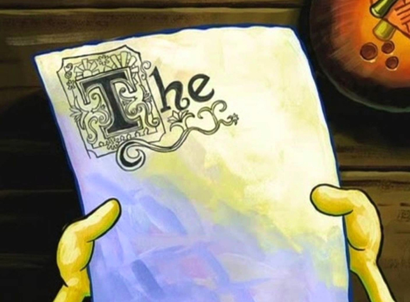
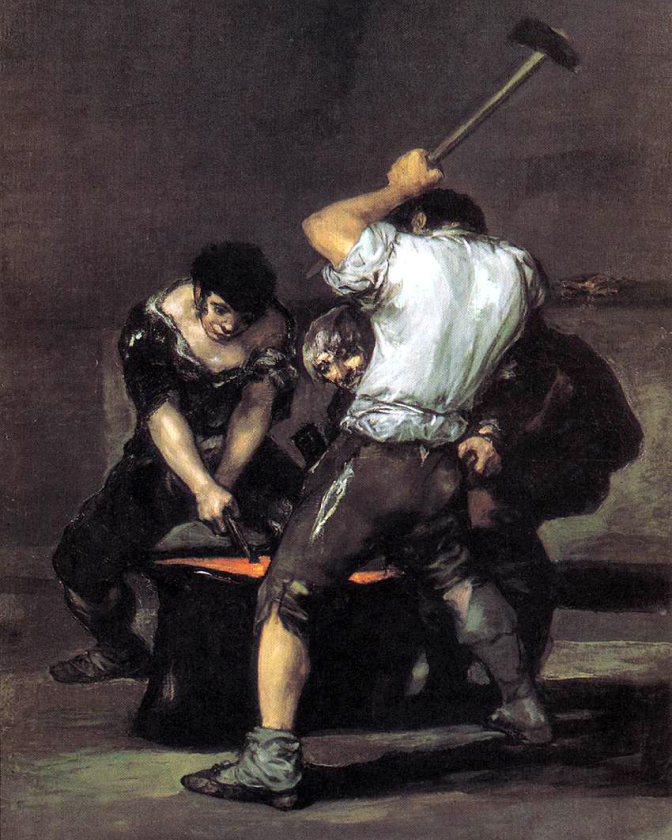

## Arise

So, it’s morning. And I hate mornings. But there's coffee, so it's not that bad. Looks like we’re off to a good start. ☕️

But back to the issue: there’s nothing to look at here. This site is basically empty. There’s potential, but not much else.

I want to start making things, but I have to be honest. Going at it alone is tough. And staring at a blank canvas is both _stimulating and paralyzing_.

Tim Urban [knows](https://waitbutwhy.com/2013/10/why-procrastinators-procrastinate.html) [the](https://waitbutwhy.com/2013/11/how-to-beat-procrastination.html) [struggle](https://www.ted.com/talks/tim_urban_inside_the_mind_of_a_master_procrastinator). [Spongebob does too](https://www.youtube.com/watch?v=sd2Q6Fagemg).

[size: m, aspect: 672x495]

## Make

It would be cool if this site became a place where I can make stuff. A place where I can try things out. Where I can share what’s on my mind. Where I can grow. Sounds nice.

Easier said than done.

Making things is hard. Not because the _doing_ is hard. But because what you do will almost always be ~~shit~~ subpar. I feel this quote sums it up best:

> quote
>
> Nobody tells this to people who are beginners, I wish someone told me. All of us who do creative work, we get into it because we have good taste. 
> But there is this gap. For the first couple years you make stuff, it’s just not that good. It’s trying to be good, it has potential, but it’s not. But your taste, the thing that got you into the game, is still killer. And your taste is why your work disappoints you. 
> A lot of people never get past this phase, they quit. Most people I know who do interesting, creative work went through years of this. We know our work doesn’t have this special thing that we want it to have. We all go through this. And if you are just starting out or you are still in this phase, you gotta know its normal and the most important thing you can do is do a lot of work.
> Put yourself on a deadline so that every week you will finish one story. It is only by going through a volume of work that you will close that gap, and your work will be as good as your ambitions. And I took longer to figure out how to do this than anyone I’ve ever met. It’s gonna take awhile. It’s normal to take awhile. You’ve just gotta fight your way through.
>
> byline
> Ira Glass

And that’s the thing. I have ideas, but they’re rough, unpolished. I have a feeling that my writing skills are in the same shape. As well as my hacking and design skills. I want to change that.

It'll take time. And it'll take work. But I guess you’ve gotta start somewhere. So I’m deciding to start here.

This is the first note I publish! 🎉

Over time, I hope to add more notes on topics that I'm interested in.

Sounds simple enough.

Narrator: It wasn’t.

## Write

OK. But wait. Why notes?!

Well, because you _write_ them.

But... Why does writing matter? 🤔

Well, because writing is like thinking. Only better.

If you want to figure something out, you should probably write about it.

As the following quote from PG suggests:

> quote
>
> Just as inviting people over forces you to clean up your apartment, writing something that other people will read forces you to think well.
>
> byline
> [Paul Graham](http://paulgraham.com/essay.html)

There’s something about it. Writing forces you to think clearly. Think thoroughly. It helps you connect the dots, fill in the gaps, and realize if you’re overdoing it with the clichés...

You might not know it, but the ideas in your mind can be really fuzzy. Incomplete. Perhaps even flawed. If you try to _really_ understand them, put them into words, or _make_ them, it becomes clear. Thoughts are inarticulate. Fleeting.

Writing is different. Writing is expression. Expressing ideas helps to form them. Or rather, _forge_ them. The blacksmith imagery seems appropriate. It takes energy. It takes focus. It takes work. But it's worth it. The material was always there, just not in the right shape. So get pounding. 🔨

[size: m, aspect: 672x840]

But wait, there’s more.

Writing can also generate _new_ ideas. 💡

At first, this seems counterintuitive. Why would you start writing about something without first knowing what you're going to write? And if you're just trying to figure out something, why write anything at all? Why not just think?

Well, again, because writing can be like thinking. You don’t start out by knowing what you’re going to think. You just think. About anything; everything. The ideas will follow.

Similarly, you can start writing without knowing exactly what you'll end up writing. And funny enough, most of what you end up writing will only come to you because you were writing. So _that’s why you write!_ Revelation, it seems, lives in writing; in creating; in making.

It's work, but it works. I believe it holds true if you’re 1) trying to figure something out, and 2) are going to show it to others. Otherwise, it might not work. You might fail to be open to learning and changing your opinions, and fall in the trap of nitpicking based on your preconceived notions and ideas. [Beware](https://waitbutwhy.com/2019/09/thinking-ladder.html). Nothing interesting will happen then. ❗

## Build

But the challenge remains — _what to build_.

Creativity and curiosity will make sure you have no shortage of ideas. And some of them might be good, some of them might be great. But another great way of preventing interesting work from happening is never finishing:

> quote
>
> You will have to make sure to start finishing, and stop starting. This will be hard.
>
> byline
> [Peter Gassner](https://blog.interactivethings.com/approaching-a-redesign-41300753e710)

Indeed. Sage advice. It feels like creativity and productivity can be bitter rivals, each vying for your time and energy. Creativity wants to explore. Productivity needs to exploit. But at the end of the day, you need to balance both. (Obviously.)

The challenge is that the distance between _conception_ and _realization_ can be vast. And trying to bridge that gap can be tough. Ideas come easy. Execution is hard. Again, not because it's _actually_ hard. But because it's work. And it can take forever. Or it can be wildly mundane. All huge turnoffs for creativity and motivation.

Creativity must be made productive. Bringing us back to the ingenious _[writing](#write)_ framework. Which recognizes that our work will never be great at the start. It'll only be a draft. Rough. Incomplete. Even disappointing. But it'll be a start — something you can build upon. And if you use the process to figure something out, learn, and explore an _idea space_, creativity and curiosity will remain happy.

And who knows. You might actually finish. You might actually do great work. Fingers crossed! 🤞

## Push

Which brings us to this site. And this post.

If you're trying to start a blog, and you're not sure where to begin, you'll find that there are [a](https://jekyllrb.com) [bunch](https://www.gatsbyjs.org) [of](https://github.com/gatsbyjs/gatsby-starter-blog) [options](https://idyll-lang.org) [out](https://medium.com) [there](https://substack.com). But none of them are ideal. At least not for me.

So after giving it some thought, I decided to start from scratch. This site is hand-built by me down to the last `<div>` and `border-radius`.

It's a good ol’-fashioned static website hosted on [GitHub Pages](https://pages.github.com) with some vanilla JavaScript on top, and Markdown on the side. It’s static, so no need to maintain servers. And it’s plain, so no need for webpack and the like. No dependencies, no bundles!

But more importantly, it _looks_ how I want, and _works_ how I want.

Basically, there were two design principles:

1. Easy to read and write.
2. Flexibility.

Easy to read and write: I want to be able to read what I write easily in it's final format as well as in the code editor. That's why this is all written on a Markdown-inspired syntax that I can tweak to my liking. It renders well on [GitHub](https://github.com), I can copy over notes from [Notion](https://notion.com), and it just makes it possible for me to write how I want to write. I can track changes through git diffs, and as for publishing? A `push` to `master` is all it takes. Easy.

Flexibility: if I come up with a new feature I want, I can easily add it. If I want to change the way something looks (or works), I can easily change it. And no huge, annoying third-party dependencies. Simple. Flexible.

> callout
>
> If you want to see the technical details and source code, head over to the [repository](https://github.com/ruizdurazo/ruizdurazo).

OK. But is all this extra and unnecessary work just another barrier to me actually finishing stuff? Well, maybe.

Admittedly, it took _waaay_ longer to get up and running than anticipated. But at least I learned a few new JavaScript and CSS tricks along the way. So not too bad. But we’ll see. If I fail, then I’ll have to reassess.

For now, it's ready. Ready for me to start writing.

Enter this first post.

It was my way of breaking the ice, and saying hello. 👋

I'm not sure it was any good. But if you've actually gone through all my rambling, I'm flattered. Thanks!

```python
print('Hello, Universe. ✌️')
```

**TLDR**: I'll be pushing myself to _make stuff_, and _put it out there_. Hopefully, in time, it will get good.

---

P.S. — On comments. I don’t like blog posts with comments. They make me cringe. So there will be no comments here.
