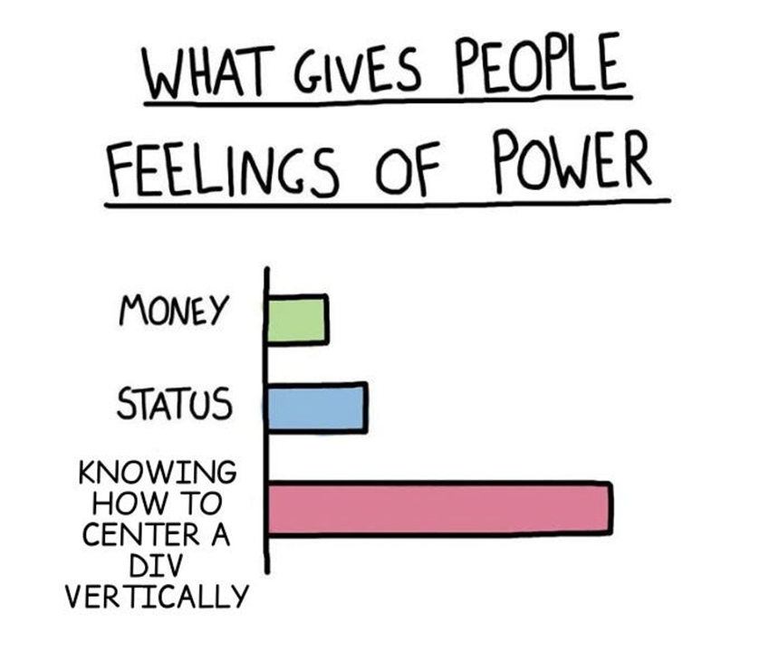

## Intro

Styling and visual design is incredibly important. It makes or breaks a user's experience. The problem is that default styles and most UI libraries are aggressively ugly. 

You need to know how to bend styles to your will.

You need to learn CSS.

[size: m, aspect: 860x720]

Here's a list of snippets I've found useful.

<!-- --- -->

## [CSS] CSS 101

Some people say that CSS is hard. But it's not.

> callout
>
> Step 1: _Select the element._<br>Step 2: _Style it._<br>Step 3: _Profit._

These are the basics of selecting:

```css
/* Basic selecting */
/* There are many ways to select elements. */
/* Some of the most common are:            */
/* - Class name                            */
/* - ID name                               */
/* - Tag name                              */
/* - Children, siblings, etc.              */

/* Selecting by class name */
.some-class-name {
  color: red;
  font-size: 16px;
  background-color: pink;
}

/* Selecting by ID name */
#some-id-name {
  color: white;
  font-size: 16px;
  background-color: blue;
}

/* Selecting by tag name */
/* Selects all elements of a certain type */
/* e.g. all <div> elements */
div {
  color: green;
}

/* Selecting by children, siblings, etc. */
/* Select direct descendant children divs of .container */
.container > div {
  color: orange;
}

/* Select any descendant children divs of .container */
.container div {
  color: orange;
}

/* Select adjacent sibling .other-container of .container */
.container + .other-container {
  color: purple;
}

/* Select elements with multiple classes */
.some-class-name.other-class-name {
  color: yellow;
}

/* Select multiple elements at once */
.some-class-name,
.other-class-name,
.another-class-name.some-other-class-name {
  color: red;
}

/* Fancier selecting */
/* There are even more ways to select elements. */
/* For example:                                 */
/* - Pseudo-classes                             */
/* - Index pseudo-classes                       */
/* - Functional pseudo-classes                  */
/* - Pseudo-elements                            */
/* - Attributes                                 */

/* Selecting by pseudo-class */
/* e.g. :hover, :focus, :active, etc. */
.some-class-name:hover {
  color: red;
}

/* Selecting by index pseudo-classes */
/* e.g. :first-child, :last-child, :nth-child(), etc. */
/* Selects the 2nd child of the parent */
.some-class-name:nth-child(2) {
  color: red;
}

/* Selecting by functional pseudo-classes */
/* e.g. :has(), :is(), :where(), :not(), :has(), :is(), :where(), :not(), etc. */
/* Selects elements that have a child element with the class .other-class-name */
.some-class-name:has(.other-class-name) {
  color: red;
}

/* Selects elements that match any of the selectors in the list */
.some-class-name:is(.other-class-name, .another-class-name) {
  color: red;
}

/* Selecting by pseudo-element */
/* e.g. ::before, ::after, etc. */
.some-class-name::before {
  content: "Hello";
}

/* Selecting by attribute */
/* e.g. [attribute], [attribute="value"], [attribute^="value"], [attribute$="value"], [attribute*="value"], etc. */
.some-class-name[attribute="value"] {
  color: red;
}
```

<!-- --- -->

## [SCSS] SCSS 101

SCSS/Sass is a _preprocessor_ for CSS. Basically, it makes CSS better.

Its most obvious feature is nested rules (but they are so good, that now [they're a part of CSS too](https://developer.mozilla.org/en-US/docs/Web/CSS/Nesting_selector)). I love nesting because it makes the code more readable, and it groups styles together in a way that can reflect the HTML structure.

Besides that, you get a different syntax for variables (`$`, as opposed to the `--` and `var()` combo), and the ability to import styles (`@use`), and a couple of other things.

```scss
// SCSS basics

// 1. Variables
// SCSS: `$`
$primary-color: #3498db;
$secondary-color: #2ecc71;
$spacing-unit: 16px;
$border-radius: 4px;
$font-stack: "Inter", sans-serif;

.some-class-name {
  color: $primary-color;
}

// CSS: `--` + `var()`
:root {
  --another-color: #3498db;
}

.some-class-name {
  color: var(--another-color);
}

// - - - - - - - - - -

// 2. Importing other SCSS files
@use "reset"; // imports reset.scss
@use "typography"; // imports typography.scss

// - - - - - - - - - -

// 3. Nesting
.card {
  background-color: white;

  // Nested media queries
  @media screen and (max-width: 768px) {
    // Calculations without `calc()`
    padding: $spacing-unit / 2;
  }

  // Nested elements (classes, ids, tags, etc.)
  // Same as `.card .button`
  & .button {
    color: $primary-color;
    opacity: 1;

    // Nested pseudo-classes
    // Same as `.card .button:hover`
    &:hover {
      opacity: 0.8;
    }
  }

  // Nested pseudo-elements
  // Same as `.card::before`
  &::before {
    content: "Hello";
  }

  // Nested element *names* (possible, but I hate this)
  // Same as `.card__header`
  &__header {
    font-family: $font-stack;
  }
}
```

<!-- --- -->

<!-- ## [SCSS] How to reset styles

Browser defaults are violently ugly. If you're serious about good design, you should be ok with breaking them completely, and crafting your own.

```scss
/* Nuke all defaults */
/* Broken is better than the default. */
/* If things are broken, you'll have to craft them. */
*,
*::before,
*::after {
  box-sizing: border-box;
  margin: 0;
  padding: 0;
  background-color: none;
  text-decoration: none;
  list-style-type: none;
  outline: none;
  border: none;
}

/* Reset mozilla form shits */
input,
textarea {
  -webkit-appearance: none;
  -moz-appearance: none;
  ...

  /* mozilla ugliness */
  &::-moz-focus-inner {
    border: none !important;
    outline: none !important;
  }
}
``` -->

<!-- --- -->

## [SCSS] How to do responsive design: Media queries

Personally, I like: 1) to stick the media queries inside the element's styles, and 2) to start the media queries from large to small using `max-width`.

```scss
.element {
  /* Styles for all screens */

  @media screen and (max-width: 1023px) {
    /* Style overrides for tablets */
  }

  @media screen and (max-width: 767px) {
    /* Style overrides for phones */
  }
}
```

<!-- --- -->

<!-- ## [SCSS+JS] How to do simple, beautiful buttons

Things I value in buttons:

- Feedback on hover, focus (with keyboard), disabled, and loading states so that it *feels* interactive or responsive
- Clean, minimal look that *feels* like a button -->

<!-- ```html

```

```scss

```

```js

``` -->

<!-- --- -->

<!-- ## [SCSS+JS] How to make fancy buttons with radar borders and hover effects

```html

```

```scss

``` -->

<!-- --- -->

<!-- ## [SCSS+JS] How to do simple, beautiful inputs

Things I value in inputs:

- Feedback on hover, focus, and error states so that it *feels* interactive or responsive
- Clean, minimal look that *feels* like an input

```html
```

```js
```

```scss
```

Result: -->

<!-- <style>
  .input {
    margin: 0 auto;
    padding: 0;
    position: relative;
    display: flex;
    flex-direction: row;
    align-items: center;
    max-width: 300px;

  }
  .input > input {
    border-color: #ddd;
    width: 100% !important;
    text-overflow: initial;

    outline: none;
    appearance: none;
    transition:
      background-color 0.2s,
      border-color 0.2s;

    padding: 8px 12px;
    width: 100%;

    border: 1px solid #ddd;
    border-radius: 10px;
    outline-offset: 0px;

    font-size: 17px;
    line-height: 17px;
  }
  .input > input:hover {
    border: 1px solid #888;
  }
  .input > input:focus {
    border-color: var(--color-secondary-highlight);
    outline: 3px solid #eee;
    border: 1px solid #888 !important;
  }
</style> -->

<!-- <div class="input">
  <input type="text" id="text-input-example"required />
</div> -->

<!-- <script>
</script> -->

<!-- --- -->

## [SCSS+JS] How to automatically resize textareas on input

You can resize the `textarea` input box to fit the content dynamically. Chat and LLM input boxes do this.

```html
<!-- Plain HTML + JS -->
<textarea id="message" rows="1" maxlength="2000"></textarea>
```

```js
// Frameworks

// Vue
<textarea
  id="message"
  v-model="message"
  rows="1"
  maxlength="2000"
  @input="resizeTextarea($event)"
/>

// React
<textarea
  id="message"
  ref={messageTextArea}
  rows={1}
  maxlength={2000}
  onInput={(e) => resizeTextarea(e)}
/>
```

```js
// 2 options: with a resizing function (for Vue/React),
// or directly in the event listener.

// Resizing function
function resizeTextarea(event) {
  // Reset the height
  event.target.style.height = "auto";
  // Set it to the scrollHeight (and probably account for border width)
  event.target.style.height = event.target.scrollHeight + 2 + "px";
}

// Get the textarea element
const textarea = document.getElementById("message");

// [HTML] Add event listener for the input event
textarea.addEventListener("input", resizeTextarea);

// - - - - - - - - - -

// Directly in the event listener
textarea.addEventListener("input", (e) => {
  e.target.style.height = "auto";
  e.target.style.height = e.target.scrollHeight + 2 + "px";
});
```

```scss
// What matters:
textarea {
  overflow: hidden;
  resize: none;
}
```

Result:

<style>
  .input {
    margin: 0 auto;
    padding: 0;
    position: relative;
    display: flex;
    flex-direction: row;
    align-items: center;
    max-width: 300px;
    
  }
  .input > textarea {
    overflow: hidden;
    resize: none;

    border-color: #ddd;
    width: 100% !important;

    outline: none;
    appearance: none;
    transition:
      background-color 0.2s,
      border-color 0.2s;

    padding: 12px 12px;
    width: 100%;
    border: 1px solid #ddd;
    border-radius: 10px;
    outline-offset: 0px;

    font-size: 17px;
    line-height: 17px;
  }
  .input > textarea:hover {
    border: 1px solid #888;
  }
  .input > textarea:focus {
    border-color: var(--color-secondary-highlight);
    outline: 3px solid #eee;
    border: 1px solid #888 !important;
  }
  .input > textarea::placeholder {
    color: #909090;
  }
</style>

<div class="input">
  <textarea id="textarea-example" rows="2" placeholder="Write something"></textarea>
</div>

<script>
  const textarea = document.getElementById('textarea-example');
  textarea.addEventListener('input', (e) => {
    e.target.style.height = 'auto';
    e.target.style.height = e.target.scrollHeight + 2 + 'px';
  });
</script>

<!-- --- -->

## [SCSS] How to add a custom font or web font: @font-face

If you want to use a custom font, and if you want to make sure that users see that font (even if they don't have it on their device), you have to add it yourself.

Cross-site caching no longer works. So you really do have to add it yourself (and cache it yourself).

For best performance:

- Add only what you need
- Lazy load it, add `swap` flag
- Provide fallbacks in your styles

```scss
// Add one font-face rule for each font, weight, and style.
// `src`: The source url can be local or remote.
// With more than one source, the browser will try the first one,
// and if it's not available, it'll try the second one as a fallback, etc.
// `swap`: The browser will display text immediately in an available font,
// and then switch to the new font when it's done loading.
@font-face {
  font-family: "Inter";
  src: url("../assets/fonts/Inter-Bold.woff"),
    url("https://example.com/assets/fonts/Inter-Bold.woff");
  font-weight: 700;
  font-style: normal;
  font-display: swap;
}
// Add more fonts, weights, and styles (italic)...
```

<!-- --- -->

## [SCSS] How to replace the default cursor with a custom one: Cursor SVG

Sometimes you see websites with quirky custom cursors. That's usually done with `cursor: url()` and an SVG.

```scss
// The source url can be local or remote.
// The image can be an SVG or a PNG, but SVGs render better.
// You need a fallback, the browser will try to load the first one,
// and if it's not available, it'll try the second one as a fallback, etc.

/* Custom default cursor */
.some-class-name {
  cursor: url("../assets/images/cursor.svg"), auto;
}

/* Custom hover state */
.some-class-name:hover {
  cursor: url("../assets/images/cursor-hover.svg"), pointer;
}
```

Result:

<style>
.custom-cursor-example {
  display: flex;
  flex-direction: row;
  align-items: center;
  justify-content: center;
  width: 100%;
}
.custom-cursor-example > div {
  width: 100%;
  padding: 100px 0;
  text-align: center;
  opacity: 0.33;
}
.custom-cursor-example:hover {
  cursor: url("data:image/svg+xml;base64,PD94bWwgdmVyc2lvbj0iMS4wIiBlbmNvZGluZz0iVVRGLTgiPz48c3ZnIHdpZHRoPSIyNHB4IiBoZWlnaHQ9IjI0cHgiIHN0cm9rZS13aWR0aD0iMS41IiB2aWV3Qm94PSIwIDAgMjQgMjQiIGZpbGw9Im5vbmUiIHhtbG5zPSJodHRwOi8vd3d3LnczLm9yZy8yMDAwL3N2ZyIgY29sb3I9IiMwMDAwMDAiPjxwYXRoIGZpbGwtcnVsZT0iZXZlbm9kZCIgY2xpcC1ydWxlPSJldmVub2RkIiBkPSJNMTkuNTAyNyA5Ljk2OTU4QzIwLjcwNzMgMTAuNDU4OCAyMC42MTU0IDEyLjE5NDEgMTkuMzY1OCAxMi41NTMzTDEzLjA2MDUgMTQuMzY1OEwxMC4xODA3IDIwLjI2MDZDOS42MDk5NiAyMS40Mjg4IDcuODg0OTkgMjEuMjE4IDcuNjEyNCAxOS45NDY4TDQuNjc2NzcgNi4yNTY0NkM0LjQ0NjM4IDUuMTgyMDQgNS41MTIxIDQuMjg3OCA2LjUzMDE5IDQuNzAxMjZMMTkuNTAyNyA5Ljk2OTU4WiIgc3Ryb2tlPSIjMDAwMDAwIiBzdHJva2Utd2lkdGg9IjEuNSI+PC9wYXRoPjwvc3ZnPg=="), pointer;
}
.custom-cursor-example .hover {
  background-color: #eee;
}
.custom-cursor-example .hover:hover {
  cursor: url("data:image/svg+xml;base64,PD94bWwgdmVyc2lvbj0iMS4wIiBlbmNvZGluZz0iVVRGLTgiPz48c3ZnIHdpZHRoPSIyNHB4IiBoZWlnaHQ9IjI0cHgiIHN0cm9rZS13aWR0aD0iMS41IiB2aWV3Qm94PSIwIDAgMjQgMjQiIGZpbGw9Im5vbmUiIHhtbG5zPSJodHRwOi8vd3d3LnczLm9yZy8yMDAwL3N2ZyIgY29sb3I9IiMwMDAwMDAiPjxwYXRoIGQ9Ik03LjUgMTJMNS40OTU5MSAxNC42NzIxQzQuOTE4NDUgMTUuNDQyMSA0Ljk3MTI3IDE2LjUxNDEgNS42MjE2IDE3LjIyMzZMOS40MDU1IDIxLjM1MTVDOS43ODQzMSAyMS43NjQ3IDEwLjMxODMgMjIgMTAuODc4OSAyMkMxMS45NjUxIDIyIDEzLjc0MTUgMjIgMTUuNSAyMkMxNy45IDIyIDE5LjUgMjAgMTkuNSAxOEMxOS41IDE4IDE5LjUgMTggMTkuNSAxOEMxOS41IDE4IDE5LjUgMTEuMTQyOSAxOS41IDkuNDI4NTkiIHN0cm9rZT0iIzAwMDAwMCIgc3Ryb2tlLXdpZHRoPSIxLjUiIHN0cm9rZS1saW5lY2FwPSJyb3VuZCIgc3Ryb2tlLWxpbmVqb2luPSJyb3VuZCI+PC9wYXRoPjxwYXRoIGQ9Ik0xNi41IDkuOTk5OTVDMTYuNSA5Ljk5OTk1IDE2LjUgOS44NzQ4MyAxNi41IDkuNDI4NTJDMTYuNSA3LjE0MjggMTkuNSA3LjE0MjggMTkuNSA5LjQyODUyIiBzdHJva2U9IiMwMDAwMDAiIHN0cm9rZS13aWR0aD0iMS41IiBzdHJva2UtbGluZWNhcD0icm91bmQiIHN0cm9rZS1saW5lam9pbj0icm91bmQiPjwvcGF0aD48cGF0aCBkPSJNMTMuNSA5Ljk5OTk4QzEzLjUgOS45OTk5OCAxMy41IDkuMTc4MzIgMTMuNSA4LjI4NTdDMTMuNSA1Ljk5OTk4IDE2LjUgNS45OTk5OCAxNi41IDguMjg1N0MxNi41IDguNTA4ODUgMTYuNSA5LjIwNTQgMTYuNSA5LjQyODU1QzE2LjUgOS44NzQ4NyAxNi41IDkuOTk5OTggMTYuNSA5Ljk5OTk4IiBzdHJva2U9IiMwMDAwMDAiIHN0cm9rZS13aWR0aD0iMS41IiBzdHJva2UtbGluZWNhcD0icm91bmQiIHN0cm9rZS1saW5lam9pbj0icm91bmQiPjwvcGF0aD48cGF0aCBkPSJNMTAuNSAxMC4wMDAxQzEwLjUgMTAuMDAwMSAxMC41IDguNjE1ODQgMTAuNSA3LjUwMDA1QzEwLjUgNS4yMTQzNCAxMy41IDUuMjE0MzQgMTMuNSA3LjUwMDA1QzEzLjUgNy41MDAwNSAxMy41IDcuNTAwMDUgMTMuNSA3LjUwMDA1QzEzLjUgNy41MDAwNSAxMy41IDguMDYyNjEgMTMuNSA4LjI4NTc3QzEzLjUgOS4xNzgzOSAxMy41IDEwLjAwMDEgMTMuNSAxMC4wMDAxIiBzdHJva2U9IiMwMDAwMDAiIHN0cm9rZS13aWR0aD0iMS41IiBzdHJva2UtbGluZWNhcD0icm91bmQiIHN0cm9rZS1saW5lam9pbj0icm91bmQiPjwvcGF0aD48cGF0aCBkPSJNMTAuNSAxMEMxMC41IDEwIDEwLjUgOC42MTU3OCAxMC41IDcuNUMxMC41IDYuMzQxNTYgMTAuNSA0LjY4OTY4IDEwLjUgMy40OTg5OUMxMC41IDIuNjcwNTYgOS44Mjg0MyAyIDkgMlYyQzguMTcxNTcgMiA3LjUgMi42NzE1NyA3LjUgMy41VjEyVjE1IiBzdHJva2U9IiMwMDAwMDAiIHN0cm9rZS13aWR0aD0iMS41IiBzdHJva2UtbGluZWNhcD0icm91bmQiIHN0cm9rZS1saW5lam9pbj0icm91bmQiPjwvcGF0aD48L3N2Zz4="), pointer;
  background-color: #ddd;
}
</style>

<div class="box">
  <div class="custom-cursor-example">
    <div>Enter</div>
    <div class="hover">Hover</div>
  </div>
</div>

<!-- --- -->

## [CSS] How to make a shimmering text effect

Nowadays, you can see a sort of _shimmering_ text effect when something is loading or when an AI model is thinking.

You can do this animation with a combination of `background-clip: text` and `background-image: linear-gradient()` (or you can also use `mask-image` with some gradient).

```html
<div class="shimmer-text">Loading...</div>
```

```scss
// Animate the background-image
// You can change the direction to go left to right,
// or right to left, by switching the `to` and `from` values,
// or by using `animation-direction: reverse`.
// Important: Make `background-position` greater than 100%.
@keyframes shimmer {
  from {
    background-position: -200% 0;
  }
  to {
    background-position: 200% 0;
  }
}

.shimmer-text {
  // So that the background gradient size is relative to the text.
  display: inline-block;
  // Gradient
  background-clip: text;
  background-image: linear-gradient(to right, black, #ccc, black);
  -webkit-background-clip: text;
  -webkit-text-fill-color: transparent;
  // Important: Make `background-size` bigger than 100%.
  background-size: 200% 100%;
  background-repeat: repeat;
  // Important: Add animation.
  animation: shimmer 2s ease-in-out both infinite;
}
```

Result:

<style>
@keyframes shimmer {
  from {
    background-position-x: 200%;
  }
  to {
    background-position-x: -200%;
  }
}
.shimmer-text-example-container {
  display: flex;
  flex-direction: row;
  align-items: center;
  justify-content: center;
  height: 200px;
}
.shimmer-text-example {
  display: inline-block;
  background-clip: text;
  background-image: linear-gradient(to right, black, #ccc, black);
  -webkit-background-clip: text;
  -webkit-text-fill-color: transparent;
  background-size: 200% 100%;
  background-repeat: repeat;
  /* background-repeat: no-repeat; */
  animation: shimmer 2s linear both infinite;
  /* animation: shimmer 2s ease-in-out both infinite; */
  position: relative;
}
.shimmer-text-example::before {
  display: block;
  content: attr(data-text);
  position: absolute;
  top: 0;
  left: 0;
  color: #666;
  z-index: -1;
}
</style>

<div class="box">
  <div class="shimmer-text-example-container">
    <div class="shimmer-text-example">Loading...</div>
  </div>
</div>

<!-- --- -->

## [SCSS] How to hide scrollbars

Add these styles to the element that overflows.

```scss
.scroll {
  /* IE and Edge */
  -ms-overflow-style: none;
  /* Firefox */
  scrollbar-width: none;
  /* Chrome, Safari */
  &::-webkit-scrollbar {
    display: none;
  }
}
```

Result:

<style>
#scrollbar-example {
  height: 150px;
  overflow-y: auto;
  margin: 0 auto;
  -ms-overflow-style: none;
  scrollbar-width: none;
}
#scrollbar-example::-webkit-scrollbar {
  display: none;
}
#scrollbar-example > div {
  min-height: 200px;
  width: 100%;
}
#scrollbar-example > div > p {
  line-height: 1.5em;
  width: 100%;
  margin: 0;
}
</style>

<div id="scrollbar-example" class="box box--padding">
  <div>
    <p>"We choose to go to the moon in this decade and do the other things, not because they are easy, but because they are hard, because that goal will serve to organize and measure the best of our energies and skills, because that challenge is one that we are willing to accept, one we are unwilling to postpone, and one which we intend to win, and the others, too." – John F. Kennedy</p>
  </div>
</div>

<!-- --- -->

## [CSS] How to create a comparison slider: Clip-path

You can overlay 2 images and compare them with `clip-path`.

```html

```

```css

```

Result:

<style>

</style>

<div class="box">

</div>

<!-- --- -->

## [CSS+JS] How to create tab transitions: Clip-path

You can animate the transition from one tab to the other with `clip-path` as well.

```html

```

```css

```

```js

```

Result:

<style>

</style>

<div class="box">

</div>

<script>

</script>

<!-- --- -->

## [CSS] How to create sticky elements: Sticky

Be aware of the difference between `fixed` and `sticky`.

Use `fixed` for **navbars**, **sidebars**, or other fixed elements.

Use `sticky` for **section headers** or similar elements.

Also, `sticky` is tied directly to its parent container, and not some grandparent element. In order to make a nested element sticky (in relation to some grandparent element or other react/vue component), JavaScript is needed.

```html
<!-- Example HTML Template -->
<div class="parent">
  ...
  <div class="sticky">Something</div>
  ...
</div>
```

```css
/* Works */
/* Parent is scrollable */
.sticky {
  position: -webkit-sticky; /* Safari */
  position: sticky;
  top: 0;
}
```

```css
/* Doesn't work */
/* Parent must be scrollable, overflow: 'hidden' would prevent this. */
/* Note - parent must also be taller than the sticky child. */
.parent {
  overflow: hidden;
}

.sticky {
  position: -webkit-sticky;
  position: sticky;
  top: 0;
}
```

Result:

<style>
.sticky-example-parent {
  height: 250px;
  overflow-y: auto;
  margin: 0 auto;
  -ms-overflow-style: none;
  scrollbar-width: none;
}
.sticky-example-parent::-webkit-scrollbar {
  display: none;
}
.sticky-example-parent > .item {
  border: 1px solid #eee;
  border-radius: 4px;
  padding: 10px;
  margin-bottom: 10px;
}
.sticky-example-parent > .sticky {
  position: -webkit-sticky;
  position: sticky;
  top: 0;
  background-color: var(--blue);
  color: white;
}
</style>
<div class="box box--padding">
  <div class="sticky-example-parent">
    <div class="item">One</div>
    <div class="item">Two</div>
    <div class="item">Three</div>
    <div class="item sticky">Something sticky</div>
    <div class="item">Four</div>
    <div class="item">Five</div>
    <div class="item">Six</div>
    <div class="item">Seven</div>
    <div class="item">Eight</div>
    <div class="item">Nine</div>
    <div class="item">Ten</div>
  </div>
</div>

<!-- --- -->

## [SCSS+JS] How to change the styling of the navbar on scroll

On some websites, you may notice that the navbar's appearance changes when you scroll. For example, you could make it smaller and/or trigger animating certain elements.

Here's how to add a drop shadow, and shrink the height of the navbar once the user scrolls down using vanilla JavaScript:

```html
<body>
  <nav id="navbar">
    <!-- Navbar items... -->
  </nav>  
  <main>
    <!-- Content... -->
  </main>
</body>
```

```scss
body {
  position: relative;
}
#navbar {
  position: fixed; // Fixed or sticky
  top: 0;
  left: 0;
  right: 0;
  z-index: 100; // Move to top
  // Default styles
  background-color: transparent;
  padding: 10px;
  // Add transitions for the styles that change
  transition: background-color 0.3s ease-out, color 0.3s ease-out, padding 0.3s ease-out;
  // More styles...
  
  // Class to add when scrolled
  &.scrolled {
    background-color: white;
    padding: 0 10px;
    // More styles...
  }
}
```


```js
// You track the scroll value, and then
// add/remove the class to the navbar.

// Get the navbar element
const navbar = document.getElementById('navbar');
// Get the scrollable container, in this case body
const scrollContainer = document.body;

// Listen to the scroll events
scrollContainer.addEventListener('scroll', function() {
  // Check if the scroll value is past a certain threshold
  if (scrollContainer.scrollTop > 0) {
    navbar.classList.add('scrolled');
  } else {
    navbar.classList.remove('scrolled');
  }
});
```


If you're using a framework, you could add something like this to a method that tracks the scroll value and updates the state accordingly. It'll depend if it's some computed variable (Vue), or some sort of hook (React), or if you'll manage it in the global state. It's up to you.

Result:

<style>
#navbar-example {
  position: relative;
  height: 250px;
  overflow-y: auto;
}
#navbar-example-navbar {
  position: sticky;
  top: 0;
  left: 0;
  right: 0;
  display: flex;
  flex-direction: row;
  align-items: center;
  justify-content: space-between;
  padding: 10px;
  background-color: transparent;
  transition: background-color 0.3s ease-out, color 0.3s ease-out, padding 0.3s ease-out;
}
#navbar-example-navbar.scrolled {
  background-color: var(--blue);
  padding: 0 10px;
}
#navbar-example-navbar.scrolled * {
  color: white;
}
.navbar-example-item {
  padding: 10px;
}
.navbar-example-content {
  padding: 10px 20px;
}
.navbar-example-content .item {
  border: 1px solid #eee;
  border-radius: 4px;
  padding: 10px;
  margin-bottom: 10px;
}
</style>

<div id="navbar-example" class="box">
  <nav id="navbar-example-navbar">
    <div class="navbar-example-item">Logo</div>
    <div class="navbar-example-item">Menu</div>
    <div class="navbar-example-item">Action</div>
  </nav>
  <div class="navbar-example-content">
    <div class="item">One</div>
    <div class="item">Two</div>
    <div class="item">Three</div>
    <div class="item">Four</div>
    <div class="item">Five</div>
    <div class="item">Six</div>
    <div class="item">Seven</div>
    <div class="item">Eight</div>
    <div class="item">Nine</div>
    <div class="item">Ten</div>
  </div>
</div>

<script>
  // Get the scrollable container and the navbar
  const scrollContainer = document.getElementById('navbar-example');
  const navbarExample = document.getElementById('navbar-example-navbar');
  
  // Add scroll event listener to the container
  scrollContainer.addEventListener('scroll', function() {
    // Check if the container has been scrolled
    if (scrollContainer.scrollTop > 0) {
      // Add the scrolled class when scrolled
      navbarExample.classList.add('scrolled');
    } else {
      // Remove the scrolled class when at the top
      navbarExample.classList.remove('scrolled');
    }
  });
</script>

<!-- --- -->

## [CSS] How to add scroll margings to elements: scroll-margin-top

Usually, websites will have fixed navbars or other elements.

When using anchors `<a href="#section">` to scroll to a section of the page (using an href with a pound sign `#`), the navbar might overlap and hide the anchor.

This might be a problem especially if the element is a heading and it's hidden. You can account for this using `scroll-margin-top`.

```css
/* Add scroll margings */
.some-element {
  scroll-margin-top: 100px;
}
```

<!-- --- -->

## [CSS] How to handle focus with :focus-visible

Only show the `:focus` ring with keyboard navigation, not with clicks or taps.

Especially relevant for buttons.

```css
/* Default for browsers that don't support it yet */
:focus {
  outline: 3px solid blue;
}

/* Hide focus styles if they're not needed */
/* for example, when an element receives focus via the mouse. */
:focus:not(:focus-visible) {
  outline: 0;
}

/* Show focus styles on keyboard focus. */
:focus-visible {
  outline: 3px solid blue;
}
```

<!-- --- -->

## [SCSS] How to do animations: Transition, Animation

Not all CSS attributes can be animated (e.g. `background` can't, but `background-color` can, `width` can't, but `max-width` can).

It is more performant to animate **colors**, **opacity**, **positions**, **transforms**.

It is less performant to animate **margins** and **paddings**.

There are two ways to do animations:

- `transition`
- `animation`

```scss
/* 1. With `transition` */
/* Specify the property, and whenever it changes, it'll animate. */
.some-class-name {
  opacity: 1;
  transition: opacity 1s linear;

  &:hover {
    opacity: 0.8;
  }
}

// - - - - - - - - - -

/* 2. With `animation` */
/* Specify name of the animation, and define its keyframes separately. */
.other-class-name {
  opacity: 0;
  animation: name-of-animation 1s linear both;
}

@keyframes name-of-animation {
  /* Start */
  from: {
    opacity: 0;
  }
  /* Option to add anything in between as percentage (e.g. 50% {...}) */
  50%: {
    opacity: 0.5;
  }
  /* End */
  to: {
    opacity: 1;
  }
}
```

<!-- --- -->

## [SCSS+JS] How to animate cycling through a list of words or phrases

I use this on the home page. It's the common text animation that loops through a list of words or phrases.

All you need to do is:

- have an array of strings or HTML elements
- add a `setInterval` that will increment a counter
- check which index of the array should be shown with modulo `%`
- define the animation styles

```html
<!-- Add an `id` to the element you want to animate -->
<!-- The element's content will be the initial value -->
<!-- 2 options: -->
<!-- 1. Whole element -->
<div id="phrase">Starting phrase</div>
<!-- 2. Single word -->
<div>Welcome, <span id="word">Harry!</span></div>
```

```js
// 1. Define the array of strings
// Can be a list of simple strings or actual HTML elements
const phrases = [
  // "Starting phrase", // You can add or exclude the initial word
  "<ins>Gryffindor</ins>",
  "Hufflepuff",
  "Ravenclaw",
  "<del>Slytherin</del>",
];
const words = [
  "Harry", // You can add or exclude the initial word
  "Ron",
  "Hermione",
  "Ginny",
];

// 2. Get the elements and define the setting and helper variables
const phrase_element = document.getElementById("phrase");
const word_element = document.getElementById("word");

// Animation settings
let anim_delay = 3500; // ms (3.5 seconds)
let anim_duration = 500; // ms (0.5 seconds)
let counter = 0; // helper

// 2. Add a setInterval that will increment a counter
document.addEventListener("DOMContentLoaded", function (event) {
  setInterval(() => {
    // Increment the counter either before or after updating the elements
    counter++;

    // [Optional] Update the elements directly (no animation)
    // 1. Whole element
    // phrase_element.textContent = phrases[counter % phrases.length];
    // 2. Single word
    // word_element.textContent = words[counter % words.length];

    // Update the elements with animation
    // Order of operations:
    // - Add the out class to current elements
    // - Remove the out class from current elements
    // - Replace the inner HTML of `phrase_element` or `word_element`,
    // - Add the in class to new elements
    // - Remove the in class from new elements

    // First, add the out class to current elements
    // 1. Whole element
    phrase_element.classList.add("fade-out");
    // 2. Single word
    word_element.classList.add("fade-out");

    // Then, remove the out class from current elements,
    // replace the inner HTML of `phrase_element` or `word_element`,
    // and add the in class to new elements
    setTimeout(() => {
      // 1. Whole element
      phrase_element.classList.remove("fade-out");
      phrase_element.innerHTML = phrases[counter % phrases.length];
      phrase_element.classList.add("fade-in");
      // 2. Single word
      word_element.classList.remove("fade-out");
      word_element.innerHTML = words[counter % words.length];
      word_element.classList.add("fade-in");
    }, anim_duration);
    // Finally, remove the in class from new elements
    // 1. Whole element
    phrase_element.classList.remove("fade-in");
    // 2. Single word
    word_element.classList.remove("fade-in");
  }, anim_delay);
});
```

```css
/* In this case, a simple fade-in/out animation */
/* But it can be any animation, like a slide-in/out, a blur-in/out, etc. */
/* Declare the animations */
/* Fade in */
@keyframes fade-in {
  from {
    opacity: 0;
  }
  to {
    opacity: 1;
  }
}
/* Fade out */
@keyframes fade-out {
  from {
    opacity: 1;
  }
  to {
    opacity: 0;
  }
}
/* Important to have a default value */
#phrase,
#word {
  opacity: 1;
}
/* Add the fade-in animation once `fade-in` class is added to the element */
#phrase.fade-in,
#word.fade-in {
  -webkit-animation: fade-in 0.5s ease-in-out both;
  animation: fade-in 0.5s ease-in-out both;
}
/* Add the fade-in animation once `fade-out` class is added to the element */
#phrase.fade-out,
#word.fade-out {
  -webkit-animation: fade-out 0.5s ease-in-out both;
  animation: fade-out 0.5s ease-in-out both;
}
```

Result:

<style>
@keyframes fade-in {
  from {
    opacity: 0;
  }
  to {
    opacity: 1;
  }
}
@keyframes fade-out {
  from {
    opacity: 1;
  }
  to {
    opacity: 0;
  }
}
@keyframes slide-in {
  from {
    transform: translateY(50px);
  }
  to {
    transform: translateY(0);
  }
}
@keyframes slide-out {
  from {
    transform: translateY(0);
  }
  to {
    transform: translateY(-50px);
  }
}
#phrase-example {
  opacity: 1;
}
#phrase-example.fade-in {
  animation: fade-in 0.5s ease-in-out both;
}
#phrase-example.fade-out {
  animation: fade-out 0.5s ease-in-out both;
}
#word-example-container {
  overflow: hidden;
}
#word-example {
  display: inline-block;
  transform: translateY(0);
}
#word-example.slide-in {
  animation: slide-in 0.5s ease-in-out both;
}
#word-example.slide-out {
  animation: slide-out 0.5s ease-in-out both;
}
</style>

<div class="box box--padding">
  <p id="phrase-example">Starting phrase</p>
  <p id="word-example-container">Welcome, <span id="word-example">Harry!</span></p>
</div>

<script>
  // 1. Define the array of strings
  // Can be a list of simple strings or actual HTML elements
  const phrases = [
    // "Starting phrase", // You can add or exclude the initial word
    "<ins>Gryffindor</ins>",
    "Hufflepuff",
    "Ravenclaw",
    "<del>Slytherin</del>",
  ];
  const words = [
    "Harry!", // You can add or exclude the initial word
    "Ron!",
    "Hermione!",
    "Ginny!",
  ];

  // 2. Get the elements and define the setting and helper variables
  const phrase_element = document.getElementById('phrase-example')
  const word_element = document.getElementById('word-example')

  // Animation settings
  let anim_delay = 3500 // ms (3.5 seconds)
  let anim_duration = 500 // ms (0.5 seconds)
  let counter = 0 // helper

  // 2. Add a setInterval that will increment a counter
  setInterval(() => {
    counter++;
    // 1. Whole element
    phrase_element.classList.add('fade-out')
    // 2. Single word
    word_element.classList.add('slide-out')

    setTimeout(() => {
      // 1. Whole element
      phrase_element.classList.remove('fade-out')
      phrase_element.innerHTML = phrases[counter % phrases.length]
      phrase_element.classList.add('fade-in')
      // 2. Single word
      word_element.classList.remove('slide-out')
      word_element.innerHTML = words[counter % words.length]
      word_element.classList.add('slide-in')
    }, anim_duration)

    // Finally, remove the in class from new elements
    // 1. Whole element
    phrase_element.classList.remove('fade-in')
    // 2. Single word
    word_element.classList.remove('slide-in')
  }, anim_delay)
</script>

<!-- --- -->

## [SCSS] How to fill a child's height to its parent: Flex stretch

Use `align-items: stretch` to do this.

```scss
.parent-class-name {
  display: flex;
  flex-direction: row;
  /* Add this: */
  align-items: stretch;

  & .child-class-name {
    /* Styles... */
  }
}
```

<!-- --- -->

## [CSS] How to add ellipsis for text overflows

**Warning**: The CSS ellipsis only works for a single line of text.

For multiple lines, JavaScript is needed.

```css
.element-with-text {
  white-space: nowrap;
  overflow: hidden;
  text-overflow: ellipsis;
}
```

Result:

With ellipsis

<style>
  #ellipsis-example {
    white-space: nowrap;
    overflow: hidden;
    text-overflow: ellipsis;
  }
</style>
<div class="box box--padding">
  <div id="ellipsis-example">
    "Humans are distinguished from other species by our ability to work miracles. We call these miracles technology." – Peter Thiel
  </div>
</div>

Without

<div class="box box--padding">
  <div>
    "Humans are distinguished from other species by our ability to work miracles. We call these miracles technology." – Peter Thiel

  </div>
</div>
<!-- --- -->

## [CSS] How to format numbers for tables: tabular-nums

You can format tabular numbers using the `font-variant-numeric` property.

Specifically, the `tabular-nums` value ensures that all numbers in the text have the same width (monospaced), making them align neatly. Useful for displaying data and prices in tables, for example.

```css
.some-class-name {
  text-align: right;
  font-variant-numeric: tabular-nums;
}
```

Result:

With `font-variant-numeric: tabular-nums;`

<style>
.tabular-nums-example {
  text-align: right;
}
.tabular-nums-example--tabular {
  font-variant-numeric: tabular-nums;
}
</style>
<div class="box box--padding tabular-nums-example tabular-nums-example--tabular">
  <div>Prices:</div>
  <div>$1,111.11</div>
  <div>$384.88</div>
  <br>
  <div>Post codes:</div>
  <div>90210</div>
  <div>11111</div>
  <br>
  <div>Phone numbers:</div>
  <div>+23 45 56 78 90</div>
  <div>+11 31 91 11 90</div>
  <br>
  <div>Credit card numbers:</div>
  <div>1234 0000 1111 3456</div>
  <div>1234 0000 9012 3456</div>
  <br>
  <div>Time:</div>
  <div>11:31:01</div>
  <div>20:34:56</div>
</div>

With the default `font-variant-numeric: normal;`

<div class="box box--padding tabular-nums-example">
  <div>Prices:</div>
  <div>$1,111.11</div>
  <div>$384.88</div>
  <br>
  <div>Post codes:</div>
  <div>90210</div>
  <div>11111</div>
  <br>
  <div>Phone numbers:</div>
  <div>+23 45 56 78 90</div>
  <div>+11 31 91 11 90</div>
  <br>
  <div>Credit card numbers:</div>
  <div>1234 0000 1111 3456</div>
  <div>1234 0000 9012 3456</div>
  <br>
  <div>Time:</div>
  <div>11:31:01</div>
  <div>20:34:56</div>
</div>

<!-- --- -->

## [CSS] How to format centered headlines: text-wrap

The `text-wrap: balance` property in CSS ensures that the lines in a text element are visually balanced.

It achieves this by distributing text more evenly across lines, rather than prioritizing the natural flow of text or the default line break behavior based on the element's width.

In certain multi-line elements like titles, headlines, or quotes, balanced wrapping really improves visual harmony, ensuring that the text appears well-distributed.

```css
.some-class-name {
  text-align: center;
  text-wrap: balance;
}
```

Result:

With `text-wrap: balance;`

<style>
  .text-wrap-example {
    text-align: center;
  }
  .text-wrap-example-balanced {
    text-wrap: balance;
  }
  .text-wrap-example h3 {
    padding: 0 10%;
  }
</style>

<div class="box box--padding text-wrap-example">
  <h3 class="text-wrap-example-balanced">
    "Humans are distinguished from other species by our ability to work miracles. We call these miracles technology."
  </h3>
</div>

With the default `text-wrap: wrap;`

<div class="box box--padding text-wrap-example">
  <h3>
    "Humans are distinguished from other species by our ability to work miracles. We call these miracles technology."
  </h3>
</div>

<!-- --- -->

## [JS] How show human readable times: RelativeTimeFormat

To show time differences in a human readable way (like "1 day ago", "in 2 weeks", etc.), you can use `Intl.RelativeTimeFormat`.

```js
// Basics

// Create a RelativeTimeFormat instance for English
// Use 'auto' for natural language formatting
const rtf = new Intl.RelativeTimeFormat("en", { numeric: "auto" });

// Days
console.log(rtf.format(-1, "day"));
// Expected output: "yesterday"
console.log(rtf.format(1, "day"));
// Expected output: "tomorrow"
console.log(rtf.format(0, "day"));
// Expected output: "today"

// Other units
console.log(rtf.format(-5, "minute"));
// Expected output: "5 minute ago"
console.log(rtf.format(-10, "hour"));
// Expected output: "10 hours ago"
console.log(rtf.format(-2, "month"));
// Expected output: "2 months ago"
console.log(rtf.format(-1, "year"));
// Expected output: "1 year ago"

// - - - - - - - - - -

// Create a RelativeTimeFormat instance for German
const rtfGerman = new Intl.RelativeTimeFormat("de", { numeric: "auto" });

console.log(rtfGerman.format(-2, "week"));
// Expected output: "vor 2 Wochen"
console.log(rtfGerman.format(1, "hour"));
// Expected output: "in 1 Stunde"

// - - - - - - - - - -

// Default is 'always' for precise numeric formatting
const rtfAlways = new Intl.RelativeTimeFormat("en", { numeric: "always" });

console.log(rtfAlways.format(-1, "day"));
// Expected output: "1 day ago"
console.log(rtfAlways.format(1, "day"));
// Expected output: "in 1 day"

// - - - - - - - - - -

// Using 'short' for shorter formatting
const rtfShort = new Intl.RelativeTimeFormat("en", { style: "short" });

console.log(rtfShort.format(-1, "day"));
// Expected output: "1 day ago"
console.log(rtfShort.format(2, "week"));
// Expected output: "in 2 wk"

// - - - - - - - - - -

// Using 'narrow' for the most compact formatting
const rtfNarrow = new Intl.RelativeTimeFormat("en", { style: "narrow" });

console.log(rtfNarrow.format(-1, "day"));
// Expected output: "1d ago"
console.log(rtfNarrow.format(2, "week"));
// Expected output: "in 2w"
```

```js
// Real-world example

// 1. Create a RelativeTimeFormat instance
const rtf = new Intl.RelativeTimeFormat("en", { numeric: "auto" });

// 2. Set date
const eventDate = new Date(); // or some createAt/updatedAt date

// 3. Calculate the difference between the dates
function getTimeDifference(from, to = new Date()) {
  // Get the difference in seconds
  const difference = Math.round((from - to) / 1000); // round to nearest second
  const abs = Math.abs(difference); // absolute value
  // Return the difference and the corresponding unit
  if (abs < 60) return [difference, "second"];
  if (abs < 3600) return [Math.round(difference / 60), "minute"];
  if (abs < 86400) return [Math.round(difference / 3600), "hour"];
  if (abs < 604800) return [Math.round(difference / 86400), "day"];
  if (abs < 2629800) return [Math.round(difference / 604800), "week"];
  if (abs < 31557600) return [Math.round(difference / 2629800), "month"];
  return [Math.round(difference / 31557600), "year"];
}

// 4) Function to update the time difference
function update() {
  const [value, unit] = getTimeDifference(eventDate);
  document.getElementById("relative-time-format-example").textContent =
    rtf.format(value, unit);
}

// 5) Start it, and update it every second
update(); // Initialize
setInterval(update, 1000); // Update every second
```

Result:

<div class="box box--padding">
  <p>Time since you visited this page: <strong id="relative-time-format-example"></strong></p>
  <p>Time since Jan 1 this year: <strong id="relative-time-format-example-1"></strong></p>
  <p>Time to Jan 1 next year: <strong id="relative-time-format-example-2"></strong></p>
</div>

<script>
  const eventDate = new Date();
  const eventDate1 = new Date(new Date().getFullYear(), 0, 1); 
  const eventDate2 = new Date(new Date().getFullYear() + 1, 0, 1);
  const rtf = new Intl.RelativeTimeFormat('en', { numeric: 'auto' });
  function getTimeDifference(from, to = new Date()) {
    const difference = Math.round((from - to) / 1000);
    const abs = Math.abs(difference);
    if (abs < 60)   return [difference, 'second'];
    if (abs < 3600) return [Math.round(difference / 60), 'minute'];
    if (abs < 86400) return [Math.round(difference / 3600), 'hour'];
    if (abs < 604800) return [Math.round(difference / 86400), 'day'];
    if (abs < 2629800) return [Math.round(difference / 604800), 'week'];
    if (abs < 31557600) return [Math.round(difference / 2629800), 'month'];
    return [Math.round(difference / 31557600), 'year'];
  }
  function update(id, date) {
    const [value, unit] = getTimeDifference(date);
    document.getElementById(id).textContent = rtf.format(value, unit);
  }
  update('relative-time-format-example', eventDate);
  setInterval(() => update('relative-time-format-example', eventDate), 1000);
  update('relative-time-format-example-1', eventDate1);
  update('relative-time-format-example-2', eventDate2);
</script>

<!-- --- -->

## [HTML] How to set break points for words and lines

Three main options:

- `<br>` for setting where to break a line, can be disabled with CSS using `display: none;`
- `&&shy;shy;` for setting where words whould be split and hyphenated
- `&&shy;nbsp;` for setting blank spaces that should not be broken into multiple lines

```html
<p>
  Some text that will be broken <br />
  into 2 lines.
</p>

<p>
  Some long word that can be <strong>hyphen&shy;ated</strong> exactly where we
  want.
</p>

<p>
  Some term that shouldn't be on 2 lines like <strong>know&nbsp;how</strong>.
</p>
```

Result (try resizing the box):

<div class="box box--padding box--resizable">
  <p>
    Some text that will be broken <br> into 2 lines.
  </p>
  <p>
    Some long word that can be <strong>hyphen&shy;ated</strong> exactly where we want.
  </p>
  <p>
    Some term that shouldn't be on 2 lines like <strong>know&nbsp;how</strong>.
  </p>
</div>

<!-- --- -->

## [HTML] Ampersands (&)

Use `&amp;amp;` for adding an ampersand (&).

The ampersand is a special character in HTML.

```html
<div>Romeo &amp; Juliet</div>
```

Result:

<div class="box box--padding"><span>Romeo &amp; Juliet</span></div>

<!-- --- -->

## [HTML] Other HTML special characters

There are certain characters that are reserved:

- `"` is replaced with `&&shy;quot;` (quotation mark)
- `'` is replaced with `&&shy;apos;` (apostrophe)
- `<` is replaced with `&&shy;lt;` (less than)
- `>` is replaced with `&&shy;gt;` (greater than)

And there are many other HTML symbols that can be used:

- `©` is replaced with `&&shy;copy;` (copyright)
- `↗` is replaced with `&&shy;nearr;` (northeast arrow)

---

If you'd like to get in touch, [write me an email](mailto:enrique@ruizdurazo.com) or [dm me on X](https://x.com/ruizdurazo).
