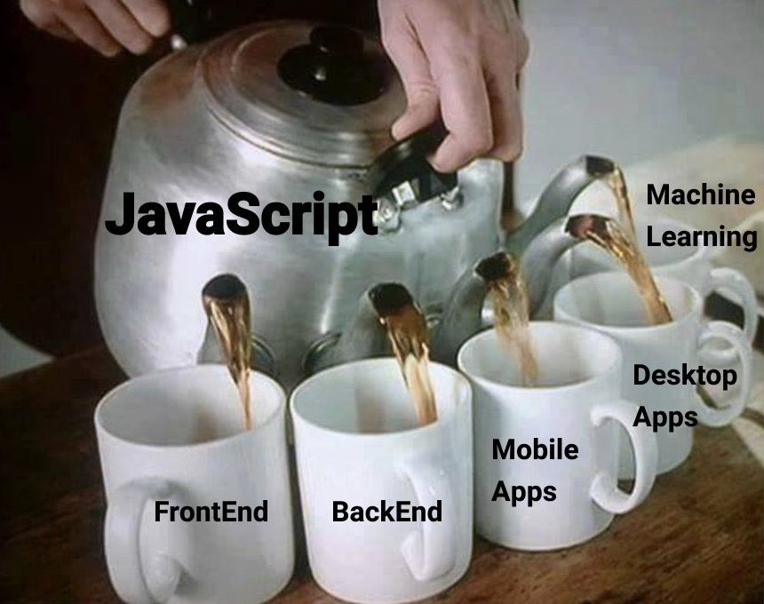

The whole world runs on JavaScript.

[size: l, aspect: 672x840]


Here's a list of notes and snippets I've found useful.


<!-- --- -->

## [JS] How to do if/else statements on a single line: Ternary operators

```js
// Ternary operators use a condition followed by a question mark (?),
// and the two values separated by a colon (trueValue : falseValue)

// Example in pseudocode:
// const result = (something that evaluates to a bool) ? trueValue : falseValue

// Real example:
const someValue = 3
const result = someValue > 5 ? 'Yes' : 'No'

console.log(result)
// Expected output: 'No'
```

<!-- --- -->

## [JS] How to check truthiness of items in an Array: Every, Some

```js
const nums = [10, 20, 50]

// Just needs some callback that evaluates each element to a boolean
// Example: const result = nums.some(callbackFn)
const resultSome = nums.some((i) => i > 20)
const resultEvery = nums.every((i) => i > 20)

console.log(resultSome)
// Expected output: true

console.log(resultEvery)
// Expected output: false
```

<!-- --- -->

## [JS] How to check if a value exists in an Array: Includes

```js
const nums = [10, 20, 50]

// Just needs some value to try to find in the array
const result = nums.includes(20)

console.log(result)
// Expected output: true
```

<!-- --- -->

## [JS] How to filter arrays based on some condition: Filter

Filter is a method that arrays have. You provide a callback that will be executed for every item in the array. It can be an arrow function or a function define elsewhere, but it should obviously resolve to a boolean: true or false. All elements that are false will be dropped in the resulting array.

```js
// Array of objects
const words = [
  //
  { word: 'spray' },
  { word: 'juice' },
  { word: 'boop' },
]

// Filter items
const result = words.filter((word) => word.word === 'boop')

console.log(result)
// Expected output: Array [{word: 'boop'}]
```

```js
// Array of strings
const words = [
  //
  'spray',
  'limit',
  'elite',
  'exuberant',
  'destruction',
  'present',
]

// Filter items
const result = words.filter((word) => word.length > 6)

console.log(result)
// Expected output: Array ["exuberant", "destruction", "present"]
```

```js
// Array of numbers
const nums = [2, 5, 10, 20, 50]

// Filter items
const result = nums.filter((num) => num > 16)

console.log(result)
// Expected output: Array [20, 50]
```

<!-- --- -->

## [JS] How to join strings with template literals: ${}

```js
// Use dollar sign and curly brackets within backticks `${}`

const someVariable = 'more string text'

console.log(`string text ${someVariable} string text`)
// Expected output: 'string text more string text string text'

const a = 5
const b = 10

console.log(`Your total is: ${a + b}`)
// Expected output: 'Your total is: 15'

console.log(`Your total is: ${sum(a, b)}`)
// Expected output: 'Your total is: 15'
```

<!-- --- -->

## [JS] How to add items to or replace items in an Array or Object: Spread syntax

```js
// Ellipsis (...), and then add the data

const someData = [14, 3]
const someItem = 4
const anotherItem = 15
const someOtherData = [11, 2]

// Spread syntax for an array
// A way to concatenate data:
const items = [...someData, someItem, anotherItem, ...someOtherData]

console.log(items)
// Expected output: Array [14, 3, 4, 15, 11, 2]
```

```js
const someData = {
  example: 12,
  anotherExample: false,
  something: 'hi',
}

// Spread syntax for an object
// A way to add on to the object
// If the key already exists, it's value will be overwritten
const otherItems = {
  ...someData,
  something: 'hello',
  somethingElse: 10,
}

console.log(otherItems)
// Expected output: Object {
//   example: 12,
//   anotherExample: false,
//   something: 'hello',
//   somethingElse: 10,
// }
```

```js
// You can merge objects using the spread syntax

const obj1 = { foo: 'bar', x: 42 }
const obj2 = { foo: 'baz', y: 13 }

const clonedObj = { ...obj1 }
console.log(clonedObj)
// Expected output: Object { foo: "bar", x: 42 }

const mergedObj = { ...obj1, ...obj2 }
console.log(mergedObj)
// Expected output: Object { foo: "baz", x: 42, y: 13 }
```

<!-- --- -->

## [JS] How to extract items from an Array or Object in a single line: Destructuring

Destructuring is a complex topic, but these are the basics:

```js
// Example with an array
const foo = ['one', 'two', 'three']

// Destructuring for an array
// Extract one or more values (in order)
const [red, yellow, green] = foo

console.log(red)
// Expected output: 'one'
```

```js
// Example with an object
const user = {
  id: 42,
  isVerified: true,
}

// Destructuring for an object
// Extract one or more values (based on their keys)
const { id, isVerified } = user

console.log(id, isVerified)
// Expected output: 42 true

// Rename key to `somethingElse`
const { id: somethingElse } = user

console.log(somethingElse)
// Expected output: 42
```

<!-- --- -->

## [JS] How to transform items in an array without using for loops: Map

Apply some method to every single item in an array.

```js
// Instead of using a for loop or forEach(), use array mapping
// map() takes a callback to apply to each item

const items = [1, 2, 3, 4]

const someMethod = (value) => {
  return value ** 2
}

// Example that produces the square of every item
const itemsTransformed = items.map((item) => someMethod(item))

console.log(itemsTransformed)
// Expected output: Array [1, 4, 9, 16]
```

<!-- --- -->

## [JS] How to sort simple arrays: Sort

```js
// Sorting an array of strings
// Default sort order is ascending

const example = ['abc', 'xyz', 'sdf']

example.sort()
// Expected output: Array ['abc', 'sdf', 'xyz']
```

```js
// Sorting an array of numbers

const example = [10, 4, 25]

// Warning: JS is wild
// This DOESN'T work as expected, it converts numbers to strings:
const wrongResult = example.sort()

console.log(wrongResult)
// Expected output: Array [10, 25, 4]

// This works for numbers:
const correctResult = example.sort((a, b) => a - b)
// or:
// example.sort(function (a, b) {
//   return a - b
// })

console.log(correctResult)
// Expected output: Array [4, 10, 25]
```

<!-- --- -->

## [JS] How to sort an array of objects: Sort

Sort the objects in an array according to the value of a single key.

```js
// Instead of using a for loop or forEach(), use sort + a callback
// or use something like lodash orderBy or sortBy

// For strings
const objs = [{ varName: 'abc' }, { varName: 'xyz' }, { varName: 'sdf' }]

const sorted = objs.sort((a, b) =>
  a.varName > b.varName ? 1 : b.varName > a.varName ? -1 : 0
)
// or:
// objs.sort(function (a, b) {
//   return a.varName > b.varName ? 1 : b.varName > a.varName ? -1 : 0
// })
console.log(sorted)
// Expected output: Array [
//   { varName: 'abc' },
//   { varName: 'sdf' },
//   { varName: 'xyz' }
// ]
```

```js
// For numbers
const objs = [{ varName: 0 }, { varName: 30 }, { varName: 10 }]

const sorted = objs.sort((a, b) =>
  a.varName > b.varName ? 1 : b.varName > a.varName ? -1 : 0
)
// or:
// objs.sort(function (a, b) {
//   return a.varName > b.varName ? 1 : b.varName > a.varName ? -1 : 0
// })
console.log(sorted)
// Expected output: Array [
//   { varName: 0 },
//   { varName: 10 },
//   { varName: 30 },
// ]
```

<!-- --- -->

## [JS] How to sort an object: Sort

This is kind of dumb, but it can be done. This is impossible in Python because dictionaries in Python don't care about the order of the keys, they get stored in a hash tree.

```js
// For numbers
const obj = {
  varName1: 0,
  varName2: 30,
  varName3: 10,
}

// Literally creating a "sorted" object
// Sorting for numbers and strings:
// .sort((a, b) => a[1] > b[1] ? 1 : b[1] > a[1] ? -1 : 0)
// For only numbers, sorting can be:
// .sort(([, a], [, b]) => a - b))
// or:
// .sort((a, b) => a[1] - b[1])
// Use Object.fromEntries() to create the new sorted object
const sortedObj = Object.fromEntries(
  Object.entries(obj).sort((a, b) => (a[1] > b[1] ? 1 : b[1] > a[1] ? -1 : 0))
)
// or:
// Object.fromEntries(
//   Object.entries(obj).sort(function (a, b) {
//     return a[1] > b[1] ? 1 : b[1] > a[1] ? -1 : 0)
//   })
// )
console.log(sortedObj)
// Expected output: Object {
//   varName1: 0,
//   varName3: 10,
//   varName2: 30,
// }

// Creating a sorted array of arrays from the original object
const sortedArr = Object.entries(obj).sort((a, b) =>
  a[1] > b[1] ? 1 : b[1] > a[1] ? -1 : 0
)
// or:
// Object.entries(obj).sort(function (a, b) {
//   return a[1] > b[1] ? 1 : b[1] > a[1] ? -1 : 0
// })
console.log(sortedArr)
// Expected output: Array [
//   [varName1: 0],
//   [varName3: 10],
//   [varName2: 30],
// ]
```

```js
// For strings
const obj = {
  varName1: 'asd',
  varName2: 'zxc',
  varName3: 'qwe',
}

// Literally creating a "sorted" object
// Sorting for numbers and strings:
// .sort((a, b) => a[1] > b[1] ? 1 : b[1] > a[1] ? -1 : 0)
// Use Object.fromEntries() to create the new sorted object
const sortedObj = Object.fromEntries(
  Object.entries(obj).sort((a, b) => (a[1] > b[1] ? 1 : b[1] > a[1] ? -1 : 0))
)
// or:
// Object.fromEntries(
//   Object.entries(obj).sort(function (a, b) {
//     return a[1] > b[1] ? 1 : b[1] > a[1] ? -1 : 0
//   })
// )
console.log(sortedObj)
// Expected output: Object {
//   varName1: 'asd',
//   varName3: 'qwe',
//   varName2: 'zxc',
// }

// Creating a sorted array of arrays from the original object
const sortedArr = Object.entries(obj).sort((a, b) =>
  a[1] > b[1] ? 1 : b[1] > a[1] ? -1 : 0
)
// or:
// Object.entries(obj).sort(function (a, b) {
//   return a[1] > b[1] ? 1 : b[1] > a[1] ? -1 : 0
// })
console.log(sortedArr)
// Expected output: Array [
//   [varName1: 'asd'],
//   [varName3: 'qwe'],
//   [varName2: 'zxc'],
// ]
```

<!-- --- -->

## [JS] How to copy text to the clipboard

```js
// Copying something, for example, when clicking a button
// Trigger this within the method you want:
navigator.clipboard.writeText('some text you want to copy')
```

<!-- --- -->

## [JS] How to add decimals

**Warning**: 0.1 + 0.2 _does not equal_ 0.3!!

```js
// Computers are wild
// Computers are binary
// So floating point math can be weird

const check = 0.1 + 0.2 === 0.3
console.log(check)
// Expected output: false

const result = 0.1 + 0.2
console.log(result)
// Expected output: 0.30000000000000004

// But why? Well, in binary64:
// 0.1 isn't 0.1
// 0.1 is actually 0.1000000000000000055511151231257827021181583404541015625

// The problem is that numbers are represented as:
// "A whole number times a power of two".
// So rational numbers such as 0.1 (which is 1/10),
// have a denominator which is NOT a power of two,
// and therefore cannot be exactly represented.

// 2 solutions:
// + 1. Truncate decimals by rounding the numbers (e.g. using `toFixed()`)
// or
// + 2. Convert to integers, do arithmetic, then convert result back to decimals

// Solution 1
// Set number of decimal places needed using `toFixed()`
// toFixed returns a string, the `+` converts the string into a number
const correct1 = +(0.1 + 0.2).toFixed(12) // 12 decimal places is still a safe bet
console.log(correct1)
// Expected output: 0.3

// Solution 2
// Brute force option of converting your decimals into whole numbers,
// and then back to decimals after doing the operation
const factor = 1000
const numbers = [0.1, 0.2]
const correct2 = numbers.reduce((x, y) => (x * factor + y * factor) / factor)
console.log(correct2)
// Expected output: 0.3
```

---

If you’d like to get in touch, [write me an email](mailto:enrique@ruizdurazo.com) or [dm me on X](https://x.com/ruizdurazo).
