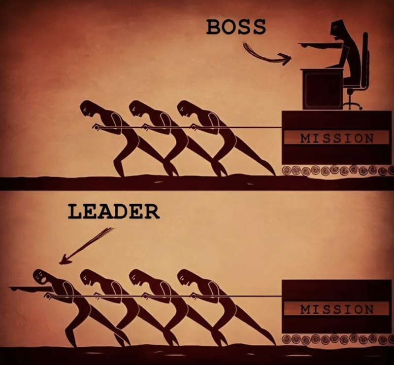

> quote
> Leadership is presence, not absence.
>
> byline
> Brian Chesky (Mr. Founder Mode)

---

## Intro

These are some of the key leadership lessons I’ve seen that work in highly-productive, flexible teams and companies. They work for teams that take their ambitious missions seriously, not so much for complacent teams in stale (often corporate) bureaucracies or quaint, small businesses.

> quote
> I think companies run at room temperature because that's their entropic equilibrium of temperature.
>
> ==But then there's people who inject heat into businesses.== Brilliant product managers, brilliant people in any job do this. They're dissatisfied with status quo. They pump energy.
>
> ==The best leaders are literally exothermic. They are just like this complete wellspring of heat into the system. Every atom jiggles faster around them. There's no chance for stasis. Nothing is frozen.==
>
> Founders are not room temperature people. By definition, the main act of starting a company is you're trying to inject heat into planet Earth. You're trying to do something like fighting against entropy; you're trying to make something better or something different.
>
> byline
> Tobi Lütke, Founder & CEO Shopify

<!-- --- -->

## Key Lessons (Very Summarized)

1. **Management = Leverage.**
2. **Spread the gospel. Repeat it.**
3. **It’s all up to you. If you don’t do it, no one will.**
4. **You lead by example. Lead from the front.**
5. **Admit mistakes. Be prepared.**
6. **Hire people that are better than you, but prove you can lead them.**
7. **Judgement & Foresight: Strive for simplicity and solve real, valuable problems.**

<!-- --- -->

## Key Lessons (Less Summarized)

1. **Management = Leverage**. The main problem you’re trying to solve is maximizing your output by leveraging your productivity or effectiveness. An army can do more than a single person. Therefore, a leader/manager has to raise and army, align resources, and focus effort towards a goal or problem. Read **High Output Management**. Elon Musk says that leading a company is all about “vector alignment”. You’re the coach, and you have to call the plays.
2. **Spread the gospel. Repeat it**. Repeat the mission, goals, and problems over and over again. You need to say what you want, and what you need them to do. Remind them what matters and _why_ it matters. And repeat it again and again. Your subordinates should know these things by heart.
3. **It’s all up to you. If you** (or your team) **don’t do it, no one will.** No one’s going to save you or tell you what to do. If you don’t act or decide, no one will. When there’s a boss (a hierarchy) the people below will abdicate responsibility and decision-making. They’re waiting on you, the leader. The leader has to take decisions _and own them_. Especially in bad times.
4. **You lead by example. Lead from the front.** If you want your team to have high standards, you’ll have to live up to (and beyond) that standard. People copy other people, especially those that hold power and status. You will model both good and bad behavior. Lead from the front. People respect leaders that are on the frontlines leading and helping out, even if it’s just performative (remember that, for better or worse, appearances matter _a lot_ in leadership).
5. **Admit mistakes. Be prepared**. Part of the unwritten contract of leadership is that leaders will own the majority share of credit and responsibility. It’s easy for leaders to claim wins and successes, but the flip side must also be true. Leaders assume all responsibility and blame for failures. Leaders that try to dodge this are the weakest, shittiest leaders around. And there _will_ be failures. **The longer you’re a leader, the higher the likelihood you’ll face a severe crisis**, whether internal or external, and of your own doing, or not. **Have a plan**.
6. **Hire people that are better than you, but prove you can lead them**. You have to have legitimacy in order to effectively lead. The easiest way is to prove that the leader has done the thing their subordinates have to do now. The next best thing is proving that you know the details and _could_ do the thing, if needed. And you need to find and lead great people. And **great people only want to work on great things with great people**. So you better make sure that you yourself are great and that you’re working on something great. Otherwise, you’ll struggle to build a formidabble team. And you can’t outsource recruiting the team either. You need to source them, pitch them, and accomodate them. “**The single most important task of a manager is to elicit peak performance from his subordinates**. So if two things limit high output, a manager has two ways to tackle the issue: through **_training_** and **_motivation_**.”
7. **Judgement & Foresight: Strive for simplicity and solve real, valuable problems.** You need to manage your time and resources. Easiest is to strive for simplicity and solve the real, valuable problems. **Strive for simplicity.** You can’t do everything but you have to understand everything that’s going on. Best way to do that is to keep things simple. Keep teams small. Don’t bloat the structure or overcomplicate things. Prune the unnecessary: unnecessary layers, unnecessary meetings, unnecessary projects. Delete, delete, delete. **Solving real, valuable problems**. The world is constantly changing. Choosing what problems to solve (or avoid) and when is incredibly important. You don’t get refunds on your time. Delete and ignore what doesn’t matter, and go all in on what really matters. Don’t copy. Think for yourself. Ultimately, are you a dead or live player?

## Key Lessons

### 1. Management = Leverage.

[size: m, aspect: 800x420]

**Management is the set of activities by which you increase your output by leveraging the resources under your control/responsibility**.

The main problem you’re trying to solve is maximizing your output by leveraging your productivity or effectiveness. And a well-run army can do a lot more than a single person. Therefore, the job of a leader or manager is to: raise an army, align resources, and focus effort towards a goal, problem, or opportunity.

Read Andrew Grove’s **High Output Management**. And then read it again. But here is a summary:

> **This book contains 3 basic ideas**. **The first is an output-oriented approach to management**. That is to say, we apply some of the principles and the discipline of the most output-oriented of endeavors—manufacturing—to other forms of business enterprise, including most emphatically the work of managers.

> **The second idea is that the work of a business, of a government bureacracy, of most forms of human activity, is something pursued not by individuals but by teams**. This idea is summed up in what I regard as the single most important sentence of this book: **_The output of a manager is the output of the organizational units under his or her supervision or influence_**.
>
> I introduce the concept of **_managerial leverage_**, which measures the impact of what managers do to increase the output of their teams. **High managerial productivity, I argue, depends largely on choosing to perform tasks that possess high leverage**.

> [The third idea of the book is that] **a team will perform well only if peak performance is elicited from the individuals in it**.

The invidivuals in that team need a leader, a coach. That’s you.

Andrew Grove says so explicitly:

> **The role of the manager here is also clear: it is that of the coach. First, an ideal coach takes no personal credit for the success of his team, and because of that his players trust him. Second, he is tough on his team. By being critical, he tries to get the best performance his team members can provide. Third, a good coach was likely a good player himself at one time. And having played the game well, he also understands it well.**

Elon Musk too says that leading a company is all about “vector alignment”. Meaning that individuals, left alone, might go off in different directions. When in reality, you, the leader, have to make sure that their efforts are all adding up towards a single direction, a single vector.

Which is just nerd-speak for: you’re the coach, and you have to call the plays.

<!-- --- -->

### 2. Spread the gospel. Repeat it.

<video src="./videos/steve.mp4" width="100%" height="100%" controls></video>

> quote
> There needs to be someone who is […] the keeper and reiterator of the vision.
>
> Because there's just a ton of work to do and […] when you have to walk a thousand miles and you take the first step, it looks like a long ways and it really helps if there's someone there saying ‘well, we're one step closer’. You know that the goal definitely exists it's not just a mirage out there.
>
> So in a thousand and one little (and sometimes larger) ways, the vision needs to be reiterated.
>
> I do that a lot.
>
> byline
> Steve Jobs

**One of the single most important things you can do as a leader is tell people what you want, what they should do, why it matters, and repeat it, repeat it, repeat it until they can literally guess the next words that’ll come out of your mouth.**

- **Tell people what you want.**
- Tell people what you need them to do.
- Tell people what they should work on.
- Tell people what matters.
- Tell people _why_ it matters, why it’s important.
- Repeat it.
- Repeat it over and over again.
- Keep it short and simple.
- Repeat it, and repeat it again.
- Never assume they know. People forget.

**Be concise**. Short, simple, memorable sentences.

If you actually tell people what you want, you’ll be surprised to find out that most people will actually want to help you (or at least cheer you on).

Whether it’s the grand mission or the problem _du jour_, if you can’t communicate clearly and simply, then you’re already failing as a leader.

Once you figure out what to say, communicate this internally (of course), but also strategically communicate it externally for hiring/recruiting and marketing/branding purposes.

<!-- --- -->

### 3. It’s all up to you. If you don’t do it, no one will.

When there’s a leader (a boss, a hierarchy), the people below will abdicate responsibility and decision-making.

No one’s going to save you, or tell you what to do. If you don’t act or decide, no one will.

**You can’t hide**. Every one will be looking to you for guidance. **Especially in bad, scary times**.

- Almost no one will tell you what to do or what the “right” thing to do is. It’s all up to you.
- People will turn to you for answers and instructions. It’s all up to you.
- People will turn to you for motivation. It’s all up to you.

Of course, you can seek advice and guidance from as many people as you want. But in the end, _you_ will have to take the decision, **_and own it_**.

You need to have **high agency** and act!

> quote
> If there's something that must exist in the world and it will not occur without you, you have to go and build it.
>
> byline
> Casey Handmer

<!-- --- -->

### 4. You lead by example. Lead from the front.

People copy other people, especially those that hold power and status. You will lead by example no matter what. You will model the culture of your team. You will model both good and bad behavior.

As, Ben Horowitz would put it: “what you do is who you are”. 

Habits and behavior (especially the leader’s habits and behavior) is what shapes the team’s culture.

- If you want people to work hard, you'll have to work hard all the time.
- If you want people to be honest and trusting, you'll have to be the _most_ honest and trusting.
- If you want people to be on time, you'll have to _always_ be on time.
- If you want people to do good work, you'll have to do _impeccable_ work.
- If you want people to show and own their mistakes, show and _own_ your mistakes.

People respect leaders that are on the frontlines leading and helping out, even if it’s just performative. Remember that, for better or worse, appearances matter _a lot_ in leadership.

[size: m, aspect: 800x740]

If fact, you _will_ be observed and judged by everyone around you.

- If you are lazy, lacking energy, and are sloppy, they will see that.
- If you are a toxic asshole, they will see that.
- If you are stupid, they will see that.
- If you are afraid and weak, they will see that.
- If you are kind and caring, they will see that.
- If you are smart and insightful, they will see that.
- If you are honest, transparent, hard-working, they will see that.

You have to lead with unwavering confidence and resolve if you want to keep your legitimacy.

<!-- --- -->

### 5. Admit mistakes. Be Prepared.

Take ownership of mistakes early, communicate well, and bring solutions to the table.

Part of the unwritten contract of leadership is that leaders will own the majority share of credit and responsibility. It’s easy for leaders to claim wins and successes, but the flip side must also be true.

Leaders assume all responsibility and blame for failures. Leaders that try to dodge this are the weakest, shittiest leaders around.

Dodging and blaming is pussy. Being negative and complaining is pussy. Staying silent is pussy. Be a strong leader and admit fuckups. Help others failing, or seek help if you are failing. own it.

And there _will_ be failures. **The longer you’re a leader, the higher the likelihood you’ll face a severe crisis**, whether internal or external, and of your own doing, or not. **Have a plan**.

People _hate_ pussy-ass-bitch leaders. People respect leaders that own it, handle crises decisively, provide answers, and make things better _quickly_. Listen to [Lulu Cheng Meservey](https://www.getflack.com/p/crisis-comms-playbook) and do as she says.

<!-- --- -->

### 6. Hire people that are better than you, but prove you can lead them.

You should want to hire great people, people that can do _the thing_ really well (duh).

The secret is that **great people only want to work on great things with great people**. So you better make sure that you yourself are great and that you’re working on something great. Otherwise, you’ll struggle to attract and build a formidable team.

> quote
> We wanted people who were insanely great at what they did, but were not necessarily those seasoned professionals. But who had at the tips of their fingers and in their passion, the latest understanding of where technology was and what we could do with that technology, and who wanted to bring that to lots of people.
>
> So the neatest thing happens is when you get a core group of 10 great people, it becomes self-policing as to who they let in to that group.
>
> So I consider the most important job of someone like myself is recruiting.”
>
> byline
> Steve Jobs

>

For hiring subordinates:

- High standards: They have to be better than the leader at doing _the thing_. Or they have to have evidence of being able to learn anything incredibly quickly and consistently succeed.
  - If the leader can do the job you do better than you, why the hell are you here?

For hiring/promoting/finding leaders:

- Legitimacy: If the leader can’t do the job they’re tasked to do well, why the hell are _they_ the leader?
  - In other words, how will the leader hold legitimacy in the eyes of their subordinates if they can’t do the thing at all? Degrees and diplomas don’t matter; only outcomes do.

Hiring great people is nice. But that’s not enough. That’s only half of the equation. The people you recruit also have to **perform**.

The best leaders know how to do _the thing_: they know how to do the thing they’re hiring for and tasked with managing. They _just_ need to lead someone better than them at doing the thing so they can have more leverage and more impact. They need to _delegate_.

**Delegating does not mean abdicating. Just because you delegated a task does not mean you abdicated the responsibility of the outcome of that task**. You remain the principally-liable person for the outcome.

You, the leader, are directly responsible for the outcomes of your unit or organization. This includes all the actions and outcomes of your subordinates. You can’t hide.

> quote
> The output of a manager is the output of the organizational units under his or her supervision or influence.
>
> byline
> Andrew Grove

>

And since you, the leader, know how to do the thing, you have no excuses. **You have to provide the tools, training, and motivation that will lead to high performance**.

Andrew Grove again:

> **The single most important task of a manager is to elicit peak performance from his subordinates**. So if two things limit high output, a manager has two ways to tackle the issue: through **_training_** and **_motivation_**.

This is why technical knowledge, domain knowledge, and experience matter. Credibility matters. Leaders must understand and be able to do the task they are delegating and supervising at the 80th percentile level or higher. You have to be able to train and motivate your subordinates effectively. And for those subordinates that need little or no training, you have to remember that great people only want to work with great people. So, what makes _you_ so great?

### 7. Judgement & Foresight: Strive for simplicity and solve real, valuable problems.

We’ve come full circle.

**Since leadership is all about leverage, you need to have incredibly good judgement and foresight for where you should apply that leverage. The quality of your judgement is what amplifies the outcomes.**

You can call it **_judgement_** or **_taste_**, that doesn't matter. What matters is that you have it. Great leaders have it. Period. It’s incredibly important. Having consistently good products, good decisions, and good technical solutions are all downstream of having good judgement.

**Judgement is so important that, because of leverage, even the difference between good judgement and great judgement is massive.**

Andrew Grove, again, gives us a simple formula:

> **Managerial Output = Output of organization = L1 × A1 + L2 × A2 +…**
>
> **This equation says that for every _activity_ a manager performs (A1, A2, and so on), the output of the organization should increase by some degree. The extent to which that output is thereby increased is determined by the _leverage_ of that activity (L1, L2, and so on).** A manager’s output is thus the sum of the result of individual activities having varying degrees of leverage. Clearly the key to high output means being sensitive to the leverage of what you do.

In other words, you need to manage your time and resources. Easiest is to **strive for simplicity** and **solve real, valuable problems**.

Delete what doesn’t matter, and go all in on what really matters.

#### Strive for simplicity.

Simplicity is nice, but it’s not necessarily what you’re after. Simplicity is a proxy for **speed** and **intelligibility**.

The default is for things to get messy, complicated, bureaucratic, **slow**.

Put in the work to clean up, make things as simple, easy, and fast as possible. Delete, delete, delete. Don’t compromise. Don’t be lazy.

You need to keep your ability to make things fast and nimble. **So much of innovation and progress is the ability to do as many tweaks and experiments as fast as possible and keep the learnings-/feedback-loop churning smoothly**. Anything that makes this complicated or slow should be a red flag. So ask yourself: what change could allow for a faster speed of iteration/innovation?

Elon has an answer for himself: "Be less dumb. Delete. Simplify. Accelerate. Automate. In that order."

Also, simplicity matters because, past a certain point of complexity, it becomes cognitively exhausting to keep a clear overview of information and org structure.

In software, UI design, code bases, and file systems, one can measure how many levels down the tree it takes to get to a certain piece of information, or how many clicks it takes to accomplish a certain task. One can then optimize for reasonable thresholds, where 3-4 steps might be the easy, cognitive limit.

Just as AI LLMs have a context window limit, humans have a cognitive load limit. As a leader, strive to keep the complexity of your organization within analogous cognitive bounds. Otherwise, you’ll lose understanding, you’ll lose control, you’ll lose visibility, and you’ll lose the ability to steer the ship.

#### Solve real, valuable problems.

You have to find the _real_ problems.

Again, the default is that things will get more complicated and chaotic. Focus on valuable problems.

Avoid useless busywork and never solve unimportant problems or problems that won’t exist. And solve growing problems when they're small and easy, not when they’re too big (either delete them or fix them).

But never optimize prematurely. Don't solve problems that will never be big, or worse yet, that will never exist. And don't solve problems with solutions that will rapidly decay forcing you to solve the same problem again and again.

Choosing what problems to solve (or avoid), and when, is incredibly important.

Again, just listen to Andrew Grove:

> **The art of management lies in the capacity to select from the many activities of seemingly comparable significance the one or two or three that provide leverage well beyond the others and concentrate on them.**

It doesn’t matter what others do, or what others expect you to do. _You_ have to be able to know what is worth doing and what isn’t.

Ultimately, are you a [dead or live player](https://medium.com/@samo.burja/live-versus-dead-players-2b24f6e9eae2)?

## Addendum

I hope you agree that the advice here works well for assuming the role of a leader and thriving in that role.

But there’s a catch.

**Leadership doesn’t exist in a vacuum.**

And ultimately, the role of leadership is to create more leaders, not merely followers.

There will be other leaders around you, above you, or below you. And there’ll always be power, social status, and emotions involved. You’ll have to navigate egos, politics, and misaligned incentives. You must act and react accordingly.

What that means is often situation-specific, or best kept secret.

Good luck.
