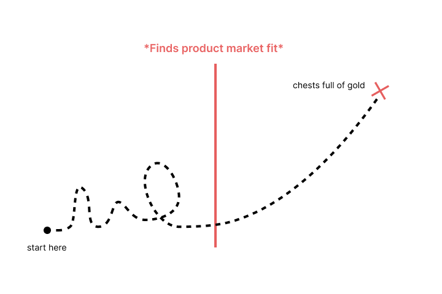
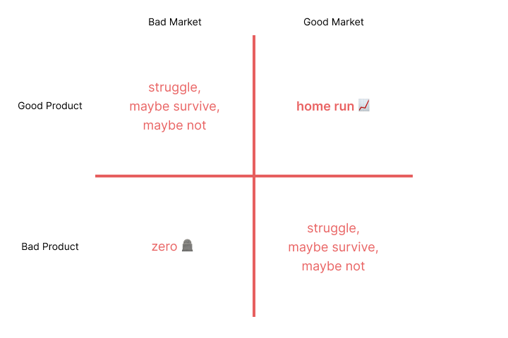
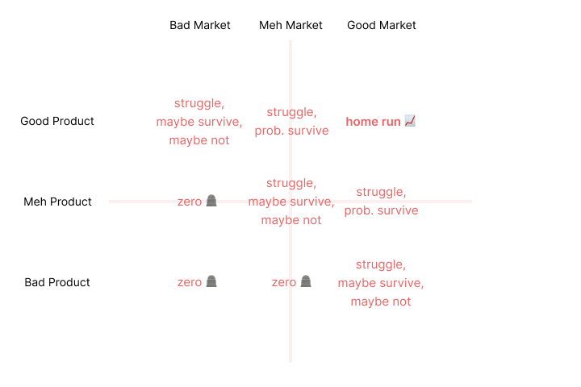
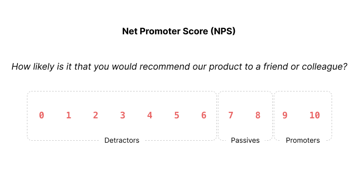
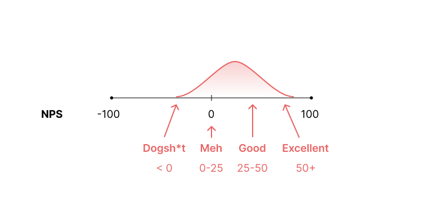
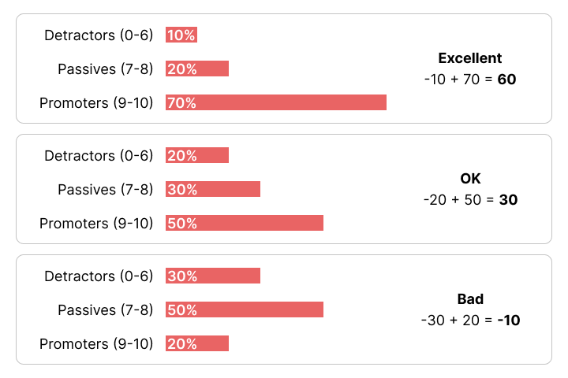
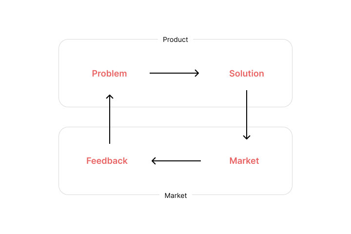

## Intro / What is PMF?

**Product-Market Fit (PMF) is the state where a product has insatiable demand in a market.**

Marc Andreessen describes PMF as the market literally taking it from your hands. Meaning that your users seemingly start taking over your product, maybe even using it for things beyond what it was intended for, and your main problem becomes keeping up with the nonstop demand. 

A meme accurately describes it:

[size: m, aspect: 800x420]

For startups, PMF is the difference between success and failure.

For as long as the product is a good fit in that market, the maker of that product will survive. 

If the product never finds a good fit, or loses it for any reason, the survival of the product’s maker will be at stake. 

So ultimately, it is a matter of life and death.

Startups that find PMF tend to grow and become successes, or at the very least, they survive. The ones that don’t, die and end up in the dustbin of history.

All successful startups found PMF; most failed startups didn’t.

For most startups, getting there is not easy and it can be a long journey. Worse yet, knowing whether you’re making any progress, or are on the right path, is often unclear.

However, there *is* a way of increasing the odds that you make it there:

- **Make a good product, be in a good market**
    - **Find a real and important problem**
    - **Find a good solution to that problem**
    - **Find a motivated customer for that solution**
- **Make sure your customers would be heartbroken if you died**
- **Iterate and learn as fast as possible to find PMF**
- **And then (and only then), grow**

<!-- image -->

[size: l, aspect: 720x480]

<!-- --- -->

## Why does PMF matter?

The short answer is: **unless you find product-market fit, you’ll never grow.** 

And the thing is: [Startup = Growth](https://paulgraham.com/growth.html).

Unless you find PMF, users won’t really value your product, will question whether it is worth paying for, and will eventually stop using it (churn). 

Any efforts to grow before finding PMF will be futile: you’ll have a leaky bucket and will basically just be burning money trying to replace customers that are leaving (and never coming back).

Once you have a product that sticks, you’ll know the difference.

> quote
> You can always feel when product-market fit is not happening. The customers aren’t quite getting value out of the product, word of mouth isn’t spreading, usage isn’t growing that fast, press reviews are kind of ‘blah,’ the sales cycle takes too long, and lots of deals never close.
>
> And you can always feel product/market fit when it is happening. The customers are buying the product just as fast as you can make it — or usage is growing just as fast as you can add more servers. Money from customers is piling up in your company checking account. You’re hiring sales and customer support staff as fast as you can. Reporters are calling because they’ve heard about your hot new thing and they want to talk to you about it. You start getting entrepreneur of the year awards from Harvard Business School. Investment bankers are staking out your house.
> byline
> Marc Andreessen

**If you have PMF, all of your most pressing problems will be related to keeping up with demand.**

**In contrast, if you don’t have PMF, all of your most pressing problems will be related to generating demand, particularly through changing and improving the product (or changing market).**

By default, startups never find PMF.

“Finding” product-market fit is hard.

Startups and founders often make mistakes from the start, and make many more along the way.

Let’s try to address that.

<!-- --- -->

## Product

A good product is a “good solution” to a problem.

The shape of a good product starts with the shape of the problem.

### Real Problems

Problems are tricky. There are problems that are real and valuable and those that are not. 

Often, founders seem to solve problems that are either not real or completely worthless. 

Don’t make that mistake.

One of the best frameworks I’ve ever come across was [Kevin Hale’s criteria for “good” startup problems](https://www.youtube.com/watch?v=DOtCl5PU8F0) (former YC partner).

*Good Problems* are:

- **Popular** (i.e. many people have it) (1M+)
- **Growing** (i.e. a growing market) (20%+ YoY)
- **Urgent** (e.g. time limit, deadline, life or death)
- **Expensive** (i.e. current solutions are super expensive) ($$$)
- **Mandatory** (e.g. mandated by law)
- **Frequent** (e.g. daily, recurring)

You have to have at least one of them (the more the merrier). And you have to have good visibility into the future. You have to be living in the future and have an opinion on what it will look like or *should* look like. 

If the problem is obvious now, chances are that someone out there realized this some time ago, started to work on a solution and, if they were any good, might have a seemingly insurmountable lead over you.

So find good, real problems. Especially problems from the near future (not distant future, nor nonexistent future).

### Good Solutions

*Good solutions* solve *real problems*. Obviously.

But what “*good solution*” means is tricky to pin down, and nearly impossible to give general advice that could apply across all markets and all business models. All of that will of course be customer- and market-specific. 

Instead, here, I’ll focus on what solution-finding actually looks like before PMF. It’s genuinely interesting and terrifying.

Even if the problem you’re solving is real, your solution has to be something people actually want.

Read that again:

***Even if the problem you’re solving is real, your solution has to be something people actually want.***

**It doesn’t even matter if you’ve solved a real problem, what matters is that people want your solution to the problem you’re solving.**

At first glance, YCombinator’s mantra is banal:

***“Make something people want.”***

But if you stop to actually think about what it means, it’s profound.

Palmer Luckey understands this.

<video src="./videos/palmer-luckey.mp4" width="100%" height="100%" controls></video>

<style>
video {
  display: block;
  max-width: min(720px, calc(100% - (var(--font-size) * 2)));
  width: 100%;
  height: 100%;
  object-fit: cover;
  border-radius: 16px;
  box-shadow: 0 10px 20px #e4e6e840;
  margin: calc(var(--font-size) * 3) auto;
}
</style>

> quote
> Before [the product] can become something that everyone can afford, it must become something everyone wants.
>
> byline
> Palmer Luckey

Listen to that over and over again.

You don’t want to fight an uphill battle trying to convince customers that your confangled solution is something they want when it’s something they’ve never even thought about or care about. 

Customers should already have the meme of your product in their minds. If they don’t, you better work on that first, or pray to God that someone can do this for you (culture, media, movies, influencers, industry influencers).

Your solution not only has to solve The Problem (or create value), it has to look like what customers would expect it to look like, or they should be able to “just get it”.

So beyond your technical ability to solve The Problem (e.g. design, engineering, delivery), you have to have the memetic ability to communicate and sell your Solution as a *desirable* one.

Founders sometimes fall into a trap. They try to invent and innovate on every front: new technology, new product, and even new market! And make everything too refined and too technically impressive. But of course, they might be creating a technology, product and/or market no one needs or wants. 

If you’re serious, more often than not, you have to **_retardmaxx_**: Just focus on your customer and create simple, convenient solutions for them.

That’s it. 

It’s hard enough as it is. Don’t make it any harder.

Your initial version probably won’t be fancy or technically impressive. Heck, you should even expect other smart people to dismiss it, or mock it.

- **Airbnb** began as “AirBed&amp;Breakfast” renting out air mattresses for conferences.
- **Uber** started with a few luxury rides only.
- **ChatGPT** was a simple AI research demo that would constantly hallucinate and had no useful tools.
- **Falcon 1** was a small rocket that couldn’t land its booster.
- The original **Tesla** Roadster was a Frankenstein toy sports car.
- **Amazon** started as some obscure online bookstore sold straight out of Jeff Bezos’ garage. No warehouses, no nothin’.
- **Instagram** came from stripping down “Burbn”, a check-in app nobody wanted, into simple photo sharing with filters.
- **Dropbox**’s MVP was literally a 3-minute video demo of file syncing. A video. The actual product didn’t even exist yet.
- **Apple** started by selling the Apple I: just a naked circuit board kit with no case, keyboard, or monitor.
- **Reddit** had almost no users at launch, so the founders created numerous fake accounts to populate the site with content.
- **LEGO** began making wooden toys and simple pull-along ducks.
- **IKEA** started as a mail-order catalog that sold random stuff like pens, watches, and nylon stockings out of a shed. Furniture came later.
- **Dyson** went through over 5,000 failed prototypes in his backyard shed before the first working vacuum cleaner.
- **Henry Ford**’s first automobile was the “Quadricycle”, a crude, open-frame vehicle built in a small shed.
- **Coca-Cola** began life as a “medicinal” syrup sold at a single Atlanta pharmacy soda fountain.
- **Stripe**’s earliest version was randomly built in Buenos Aires, Argentina. The Collison brothers flew there for a month, lived cheap, and hacked in cafés until they had the bare-bones tool that let any developer accept credit cards online with just a few lines of code.
- **PayPal** started as “Confinity”, something that let people beam money to each other via Palm Pilots. **Peter Thiel** himself admits “it was voted one of the 10 worst business ideas in 1999, and 1999 was a year where there were many bad ideas in technology”.

<video src="./videos/thiel-paypal.mp4" width="100%" height="100%" controls></video>

Just launch, refine, and be prepared to relentlessly obsess about your customer for as long as you’re alive.

Finding a **good solution** to a **real problem** will likely take longer than you think. 

Developing an impressive Product takes iteration. 

Iteration is not free: it costs time, effort, money. Plan and budget accordingly. 

Because you probably won’t hit it out of the park on your first try, you’ll be having to try and try again. Maximize attempts by staying lean and resourceful. Make sure you don’t die. The goal is to stay alive long enough to find PMF. You have to be lean, scrappy, and fast. 

There’s that saying that it takes at least 3 versions of a product for it to be truly good and ready for mass scale. So iterate, iterate, iterate.

[size: l, aspect: 720x480]

Launch and **talk to customers**. You need feedback. Iterating without talking to them will be like trying to hit the bullseye with a blindfold. Sure, you might have several shots, but if you can’t see anything, you’ll be relying on blind luck, literally.

Speaking of customers...

<!-- --- -->

## Market

### Motivated Customers

The *Market* in Product-Market Fit is made up of customers. 

Customers can come in all shapes and sizes: they can be individual users, large companies, or anything in between. 

The one thing that they have to share is that they have to be *motivated*. 

They have to be motivated to try your solution, pay for it, and ultimately prefer it over others.

**For startups, customers have to be crazy enough to give your scrappy company a try. And honestly, they have to be either desperate (sounds harsh, I know), or they have to be really, *really* excited about what you are doing.** 

Urgency through inspiration or desperation. Or both.

> quote
> When a startup launches, there have to be at least some users who really need what they’re making — not just people who could see themselves using it one day, but who want it urgently.
> byline
> Paul Graham

### “The Market”

Quick digression…

We’ve already talked about “The Market” indirectly by talking about 1) having a real problem, need, or desire, 2) the demand for a solution to it, and 3) who the customers might be. 

But now let’s talk about it directly, and what the implications are.

If you look in a dictionary, it’ll say that a market is:

> 1. ***A regular gathering of people for the purchase and sale of provisions, livestock, and other commodities.***
> 2. ***An area or arena in which commercial dealings are conducted.***

But, honestly, that definition is trash because it glosses over the real significance of what a market really is. 

Of course, the dealing, trading or exchanging is what you *see* in a market, but my definition would be something more like:

> ***A market is a learned social behavior in response to needs or desires, where one side expresses a need or desire, and another fulfills it (voluntarily) in exchange for something of value.***

The need or desire can indeed be for “provisions, livestock, and other commodities”, but on the other side must be a party that is *willing and able to provide them at an agreeable quality and cost*.

The “purchase and sale” or “commercial dealings” from the dictionary definition can’t be taken for granted. 

There must be a good *fit* between seller and buyer, between *product* and *market*!

Thus, “The Market” *is* those customer needs and desires themselves, along with their expression. 

The expression can be obvious, in-your-face, well-known, or subtle, hidden, novel; explicit or implicit. It can be a pressing, recurring need or desire, or it can be something fleeting, tenuous, impulsive.

There is profundity there.

In fact, most of the time you can replace the word “market” with “need or desire” and the sentence will not only still make sense, it’ll be more profound.

Being in a good Market is just as important as having a good Product, if not more so. 

At the start, you’ll be so small that you’ll be at your market’s whims. Your market will control you: your market’s destiny will be *your* destiny.

So the least you can do is pick your market wisely.

Most startups forget that they have (some) control over their Market. At a minimum they can decide which market(s) they want to be in. And, in time, they might even influence the dynamics and behaviors of the market(s) they’re in.

In the limit, it’s a 2x2 matrix.

[size: l, aspect: 720x480]


In reality, of course, it is a spectrum. 

[size: l, aspect: 720x480]

> quote
> When a great team meets a lousy market, market wins. When a lousy team meets a great market, market wins. When a great team meets a great market, something special happens.
>
> byline
> Andy Rachleff

> quote
> You can obviously screw up a great market — and that has been done, and not infrequently — but assuming the team is baseline competent and the product is fundamentally acceptable, a great market will tend to equal success and a poor market will tend to equal failure.
>
> byline
> Marc Andreessen

From all of this, I challenge you to think more deeply about markets, and the markets you participate in.

- What’s the need/desire being fulfilled? Is it recurring? Enduring?
- Will there still be demand in the future? More? A lot more? Less? Why?

Startups often harp on about product features, details, technologies, and, vaguely, “the future”. Rarely do they think deeply about markets (or desires). But they should.

After all, it’s Product-***Market*** Fit.

## Feedback

Ok. But *how do you know* you are making something people want?

Basically, you need to extract feedback from your customers (your Market).

There are at least 4 ways to get *useful* feedback and know whether you’re close to finding PMF or not:

- **Revenue**: your customers are actually paying, using your product, and sticking around. (revenue, retention, etc.)
- **Excitement**: NPS, how likely are your customers to recommend your product to others?
- **Disappointment**: your customers would be devastated if you went out of business.
- **Pain**: seeing your customers struggle or complain about something.

### Revenue

Metrics like revenue, retention, or conversion rates offer a good, obvious bar.

There are plenty of resources out there on the hard business metrics you should be tracking depending on your industry, market, or business model.

Basically the question is: are your business metrics growing without even spending on ads? Meaning that somehow word got out and spread, and customers are actually paying and using your product. If that happens, you might have found PMF.

But sometimes either revenue signals are not clear enough, or there is no revenue at all yet. Here I want to talk about the other ways to know if you’re on your way towards product-market fit: **how do your customers feel, and do they even care?**

### Excitement

A tried and tested metric to measure user excitement for your product is NPS. 

Net Promoter Score (NPS) is a standard metric that tries to measure how enthusiastic your users are about your product. NPS is calculated based on responses to a single question: **How likely is it that you would recommend our product to a friend or colleague?**

The scoring for this answer is most often based on a 0 to 10 scale.

[size: l, aspect: 720x360]

Those who respond with a score of 9 to 10 are called “**Promoters**”, and are considered likely to exhibit “value-creating behaviors”, such as buying more, remaining customers for longer, and making more positive referrals to other potential customers through word-of-mouth (i.e. they either think your product is really good or they even *love* your product). 

Those who respond with a score of 0 to 6 are labeled “**Detractors**”, and they are believed to be less likely to exhibit the “value-creating behaviors” (i.e. they either think it kind of sucks or outright *hate* your product). More likely, they’ll be telling people to stay away from your product.

Responses of 7 and 8 are labeled “**Passives**”, and their behavior falls between Promoters and Detractors (i.e. they think your product is somewhere between “fine”, “meh”, or “could be better”).

The Net Promoter Score is calculated by subtracting the *percentage* of customers who are Detractors from the *percentage* of customers who are Promoters. For purposes of calculating a Net Promoter Score, Passives count toward the total number of respondents, thus decreasing the percentage of detractors and promoters and pushing the net score toward 0. 

The NPS score range is -100 to 100. Meaning that:

- If 100% of respondents answered 9 or 10, then the score is a perfect 100.
- If 100% of respondents answered 7 or 8, the score is a 0.
- If 100% of respondents answered between 0 to 6, the score is a horrific -100.

In reality, the score distribution for companies looks something like:

[size: l, aspect: 720x360]

In other words:

- Negative: People hate you
- Zero or slightly positive: People don’t care
- Positive: People like you
- 50+: People love you

Businesses that people hate don’t last long.

The distribution of the 3 groups also matters (promoters, detractors, passives). It varies, but you could say that the image below describes real score compositions.

[size: l, aspect: 720x480]

When analyzing the results, you’ll want to also segment your customers by their personas or usage behaviors.

 

- Who are the ones that love it, and how are they using your product? (Focus on selling that feature, don’t mess with it, and/or find more of those customers).
- Who are the ones that hate your guts, and what are they trying to do? Are they doing something wrong? (Either fix this, or drop these customers if you don’t care for them)

### Disappointment

As we’ve seen, with NPS, we can have a proxy for excitement, but the inverse is also very useful.

[In this article](https://review.firstround.com/how-superhuman-built-an-engine-to-find-product-market-fit/), Rahul Vohra and Sean Ellis suggest that it is wise to ask your customers the following question: **“How would you feel if you could no longer use [the product]?”**

After all, you and your team are probably pouring your hearts and souls into the damn solution, so it’d be nice to know whether your users actually ~~give a shit~~ appreciate it, and would be bummed if you were not around, right?

> quote
> Just ask users “How would you feel if you could no longer use [the product]?” and measure the percent who answer ‘very disappointed’.
> byline
> Sean Ellis

In practice, the question looks like:

**How would you feel if you could no longer use [the product]?**

- **Very disappointed**
- **Somewhat disappointed**
- **Not disappointed**

The target you’ll be wanting to hit is 40%+ “**Very disappointed**”.

With your revenue and conversion/retention metrics, NPS scores, and disappointment scores, you should have a good picture of whether your customers care about your product or not at all.

### Pain

Last but not least: pain.

If you’re serious, you have to *obsess* about the customer.

The metrics above were almost passive: things you can get from analytics or simple online forms you can set up. 

But if you take matters into your own hands, you’ll want to actually talk to users and inspect individual use cases of your product. All while keeping an eye out for pain: friction, stumbling, errors, frustration, and what users actually want.

- Just talk to your customers and personally ensure their success. Founders should do this.
- Talk to your top customers and figure out if even they had any annoyances.
- Onboard new customers yourself and see how smooth and intuitive it feels (or not). Guarantee their success.

You’ll see if they think it’s smooth, easy, and delightful, or the complete opposite of that.

Before PMF it is essential that you do many things like this.

As YC recommends: ***“Do things that don’t scale”***.

## Loop

If you’ve been paying attention, we’ve closed a **loop**.

There are many names for these kinds of loops: “feedback loops”, “OODA loops” (Observe, Orient, Decide, Act), etc.

Here is the pseudo-code for the PMF OODA Loop:

```
pmf = false

while pmf == false:
    product = real problem (i.e. need, desire) +
              good solution (i.e. quality, cost)
    feedback = get_market_feedback() (e.g. revenue, excitement, disappointment, pain)
    if feedback == shut_up_and_take_my_money:
        pmf = true
    else: tweak_problem_solution_and_or_market()

if pmf: grow()
else: rest_in_peace()
```

[size: l, aspect: 720x480]

If after having done all that on a first pass you still haven’t found PMF, you have to be prepared to do another pass, and another, and another, until you do (or don’t).

Most don’t.

### Iterate

Startups don’t have many advantages, but they can:

1. Act fast.
2. Learn and adapt (fast).
3. Be scrappy.
4. Try crazy things that don’t scale.

In short, you better go through as many loops as possible.

Remember, your (startup’s) life depends on it.

> quote
> Companies often go through many iterations before they find product-market fit, if they ever do.
>
> byline
> Andy Rachleff

<!-- --- -->

## Summary

- Finding Product-Market Fit is **hard**.
- Unless you find it, you won’t grow and your startup will die.
- Your product has to be good AND your market has to be good.
- You have to have a *good solution* to a *real problem* that *motivated users* have.
- If you don’t have all this, then you have to relentlessly iterate and iterate until you do.
- Most people go at this blindly. Or rely solely on taste or vibes. The problem? Most people have horrible taste, if any at all.
- It can be tricky to measure or structure your customers’ opinions and product feedback. But a good way to know whether you are making any progress is by talking to customers, charging customers, measuring their rate of success and retention, and overall excitement, disappointment, and pain.
- *That* is the optimization function or feedback loop you can use to find PMF more reliably.
- You better get there before your runway (or ability to raise funds) runs out.
- Good luck.

With all this in mind, it’ll be no less hard, but at least you won’t be going at it blindly. And who knows, you just might find **_Product-Market Fit_**. 

Then (and only then) can you really focus on: Growth.

<!-- --- -->

## Resources

- [A16Z: 12 Things About Product-Market Fit](https://a16z.com/12-things-about-product-market-fit/)
- [Marc Andreessen: Guide to Startups Part 4](https://pmarchive.com/guide_to_startups_part4.html)
- [Sam Altman: Before Growth](https://blog.samaltman.com/before-growth)
- [Sam Altman: Startup Advice](http://blog.samaltman.com/startup-advice)
- [Paul Graham: Startup Ideas](https://paulgraham.com/startupideas.html)
- [Rahul Vohra: How Superhuman Built an Engine to Find Product-Market Fit](https://review.firstround.com/how-superhuman-built-an-engine-to-find-product-market-fit/)
- [Kevin Hale: Criteria for “Good” Startup Problems](https://www.youtube.com/watch?v=DOtCl5PU8F0)