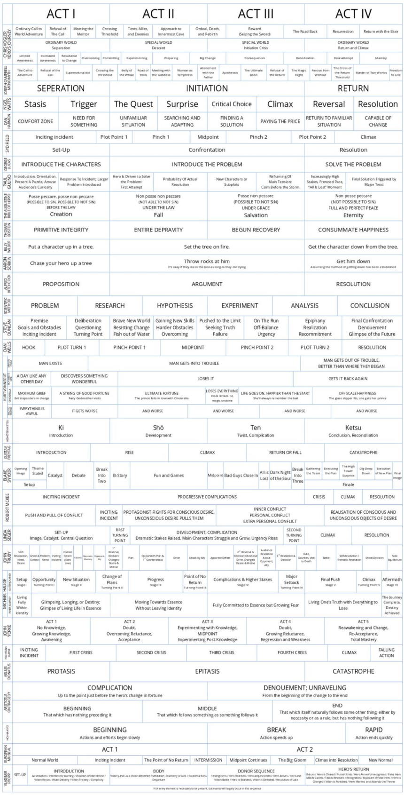
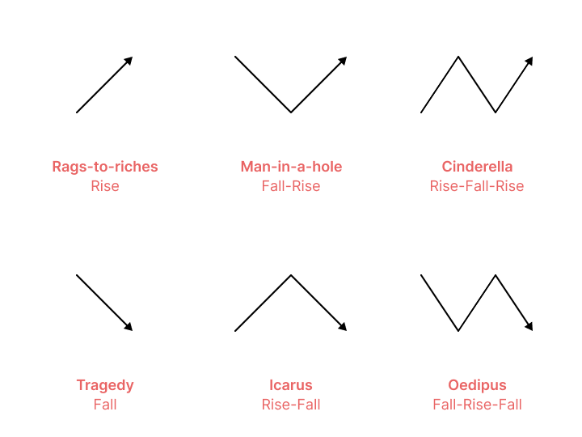

## Intro

The best stories rule the world.

Whether it's culture, history, politics, business, or even science and technology and anything in between.

That's why understanding the DNA of stories matters.

The Oxford English Dictionary defines **_narrative_** as:

> **_An account of a series of events, facts, etc., given in order and with the establishing of connections between them._**

Central to this definition is the notion of **_a chain of causally related events_**.

In other words, stories have a beginning, middle, and end: an introduction, an unfolding series of events often involving tension or conflict, and, finally, a resolution (or cliffhanger).

But at a deeper level, stories can essentially be seen through the lens of three main abstractions: **_structures_**, **_elements_**, and **_shapes_**.

## Structures (Good)

There's plenty of material out there about analyzing stories through the lens of their structure.

But, honestly, most story structures are basically the same. They fit the typical pattern of: beginning, middle, and end.

**_3 Act Structure_** (Syd Field)

- **Setup**: hero has a goal or desire
- **Confrontation**: tries to chase it, but there’s a crisis (it’s not easy to achieve)
- **Resolution**: makes a change, hard choice, or fights the battle, and then achieves the goal (happy ending), or doesn’t (tragedy)

**_Story Circle_** (Dan Harmon, Rick and Morty co-creator)

- A **character** is in a zone of comfort
- But they **want** something
- They **enter** an unfamiliar situation
- **Adapt** to it
- **Get** what they wanted
- **Pay** a heavy price for it
- Then **return** to their familiar situation
- Having **changed**

> callout
> The _Story Circle_ works well for cyclical or episodic content, or for when someone goes on an eventful adventure or holiday, for example, but have to go back to their “normal” lives and routine afterward.

There’s many more structures, but they’re all basically the same:

[size: l, aspect: 860x540]

The problem is that structures don't actually explain _why_ a story works well, or why it doesn't (and what to do about it). That's where "elements" come in.

## Elements (Best)

A more profound and flexible way of understanding and crafting stories is with its individual parts, its _elements_.

**_Elements of Story_** (John Yorke)

- **Protagonist**
- **Antagonist**
- **Inciting Incident**
- **Desire / Journey**
- **Crisis**
- **Climax**
- **Resolution**

The _Elements of Story_ are great because they are flexible, they don’t impose a rigid structure, but rather get to the root of the ingredients you need to create a great story.

They work across literally any structure, whether it’s linear or not.

Once you’re familiar with the elements, you can easily use them to analyze great stories.

You start having a better sense of why a story works well, or explain why it doesn’t and what’s missing.

Why? Because you start asking questions:

- **Is there a clear protagonist with a deep longing or desire? Or, are they going through some life-changing crisis?** How bad do they want their desire? What are they willing to do for it? Did their circumstances recently (radically) change? Do they want to escape their current situation? Or go back to the way things were?
- **Is there something in the way?** Is there really a formidable villain or obstacle in their way? Are the odds stacked against them?
- **Is there any drama?** Do they have to actually make tough choices? Face tough challenges? Take risks? Make sacrifices?
- **Does it answer the dramatic questions?** Does something actually happen? Does anything actually change? Is there a resolution to the story? Is there a happy ending? A sad one?
- **Does it lack any of the elements? And does it fail to convincingly answer the dramatic questions above?**

If the elements are missing or weak, the story will be weak.

You can use these and other questions to analyze stories.

And you can obviously also use them to write great stories too! ✍️

### A Good Story

And so, roughly, a good story looks something like this:

1. A **protagonist** has a strong **desire** either inherently, or as a result of an **inciting incident**.
2. But there's a formidable **antagonist** in the way.
3. The protagonist tries to chase their desire, but faces a **crisis**. It's not easy. They must make tough choices and sacrifices.
4. The protagonist faces the antagonist in a **climactic** way.
5. The protagonist gets what they originally desired (or doesn't). There's **resolution**. If there is no resolution, you get a cliffhanger for the next part of the story.
6. The protagonist (and perhaps the world around them) has changed. The story has **consequences**.
7. End of story.

That's more or less what a good story looks like. And importantly, you can easily fit this into any structure you like. It's the elements, not the structure, that make or break a story.

That being said, there are a couple more things you should constantly be thinking about when using the elements of story.

### Pro Tips

#### 1. "Who am I?"

That’s what the audience thinks/feels at the beginning of any story (whether consciously or subconsciously). So that’s the question that you have to answer at the beginning of a story.

Who’s the protagonist, the main character? Who should I care about? And what do they want?

You need to hook the viewer to a character. The faster you solve this, the better. Otherwise they won’t follow the story and will lose interest, fast.

They need to identify and empathize with someone. They will want what that character wants, feel what that character feels, and experience the story through their shoes.

#### 2. Antagonists

The greater the gap between the protagonist and their desire, the better the story.

The larger, badder, more powerful the antagonist, the better the story.

> quote
> “If there isn’t a great villain, there isn’t a good story.”
>
> byline
> Steven Pressfield

There has to be a formidable antagonist to be defeated (or overcome). An antagonist isn’t necessarily an evil person, but simply an adversary, or hurdle: something in the way of the protagonist and their desire.

The antagonist can be something physical (like a door that's locked, or boulder that's in the way), or even something abstract (like time running out, or a personality weakness like self-doubt or arrogance).

A great antagonist forces the protagonist into making difficult choices to get what they desire.

The protagonist and antagonist might even want the same thing, and there might be only one winner in the end. (Batman vs Joker, Allies vs Axis, Yankees vs Red Sox, Federer vs Nadal, Lee Sedol vs AlphaGo).

The hero must struggle, and even suffer. But try to make the suffering worthwhile. Suffering can be rewarding in its closure and hopefulness. Suffering builds character. But suffering can also be depressing in its senselessness and hopelessness. Audiences prefer rewarding, hopeful, _sensical_ endings.

#### 3. Consequentiality

Link story elements with **“therefore”** or **“but”**. Never just **“and then”**.

_A_ → _B_

_A_ leads to _B_, and there's no going back.

Make it _feel_ consequential.

Never tell a story using “and then”, “and then”, “and then” because that’s just horrible storytelling. Usually, that’s just a list of inconsequential elements that you can rearrange without changing the quality of the story.

Make sure that each of the parts of your story create, or respond to, _consequences_ (even if they are out of chronological order).

#### 4. Multiple plot lines

If you have a complex story with several plot lines, you can use “**meanwhile back at the ranch**” to switch between them.

Meaning: start with one plot line and build suspense, and then cut to the other one in order to avoid it feeling drawn out, to skip boring parts, or to just keep it interesting.

Maybe they cross at some point (as they usually do).

Examples: _Girl with the Dragon Tattoo_, _Star Wars_, and many, many TV series.

#### Bonus tip: Instability & Loss of Control

Every now and then, unsettling, tense, inevitable outcomes spice up a story.

For most people, it’s an uneasy feeling to lose control. But the interesting thing is that they will want to endure the dispair, being fully engaged, hoping for catharsis and regaining control, no matter if the ending is happy or terribly tragic. They might know that they're in the middle of witnessing a trainwreck that can't be stopped, but they won't look away.

## Shapes & Arcs

Beyond story structures and elements, stories also have a shape, an arc.

It's what determines the path the protagonist will go on, and whether there'll be a happy ending or a tragic one.

Stories have 6 primary arcs:

- **“Rags-to-riches”** (Rise)
- **“Tragedy”** (Fall)
- **“Man-in-a-hole”** (Fall-Rise)
- **“Icarus”** (Rise-Fall)
- **“Cinderella”** (Rise-Fall-Rise)
- **“Oedipus”** (Fall-Rise-Fall)

[size: l, aspect: 720x540]

From this, we can basically conclude that there are 2 main arc types:

- **Ascending** (Happy ending)
- **Descending** (Tragic ending)

With this framework, you can either:

1. try to analyze a story to see what its shape is, or
2. mould it to give it a clearer shape, a direction.

The trends and shapes can also be juxtaposed within the same story. For example, Character A is on an ascending arc, while Character B is on a descending one. And in a story with multiple plot lines, some might be ascending, and others descending. Or any other combination of arcs.

## Story Is King 👑

Why does any of this matter?

Because our entire civilization runs on stories.

And because **best story wins**.

Not sometimes wins, not most of the time wins, but _always_ wins.

The best story _always_ wins.

> quote
> Best story wins. It’s not the best idea, it’s not the right answer, it’s the best story that gets people nodding their heads.
>
> byline
> Morgan Housel

**Even if someone is the first to write a story, someone else can always come along with a better version of that same story. What will be remembered is the better story.**

Even if a movie has great visuals or great sound, if it’s not a good story, it’ll be easily forgotten.

Even if a history book is detailed and historically accurate, if it’s not a good story, it’ll be easily forgotten.

And importantly, **the inverse is true!**

Even if a story is wrong or fake, but is a great story, it’ll be remembered.

**What will be remembered is the better story.**

**Story is king. 👑**

The end.

---

## Resources

- [The Girl with the Dragon Tattoo — Breaking Convention](https://www.youtube.com/watch?v=yYMhaILOs-I)
- [The Dark Knight — Creating the Ultimate Antagonist](https://www.youtube.com/watch?v=pFUKeD3FJm8)
- [F for Fake (1973) - How to Structure a Video Essay](https://www.youtube.com/watch?v=1GXv2C7vwX0)
