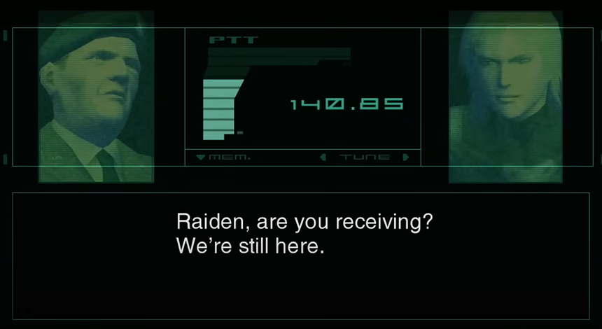
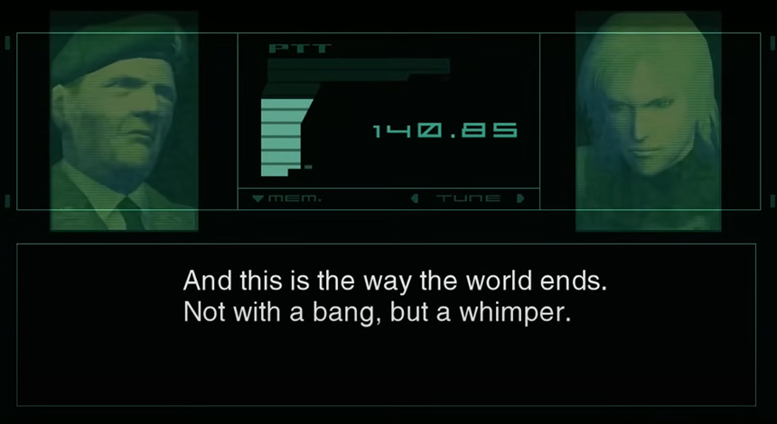
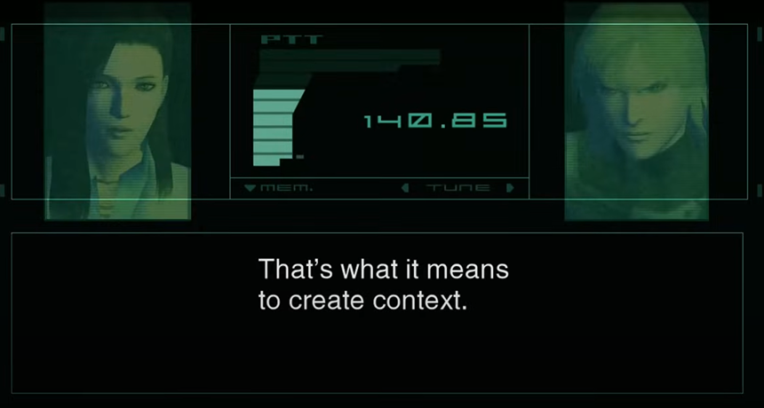
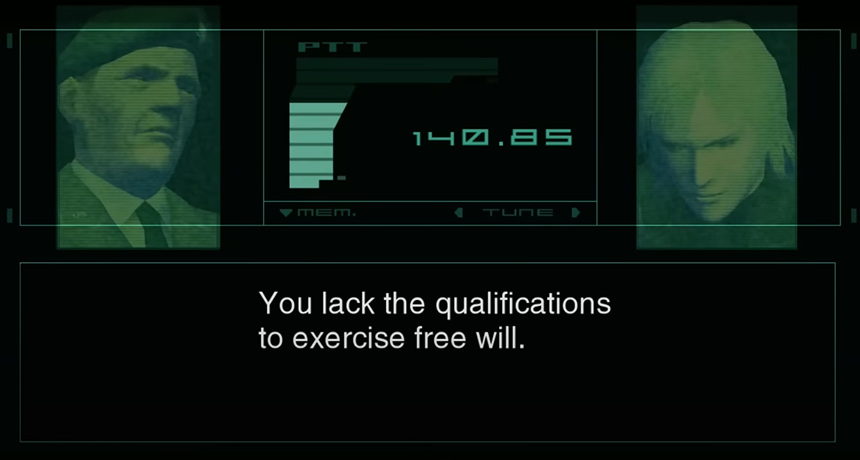
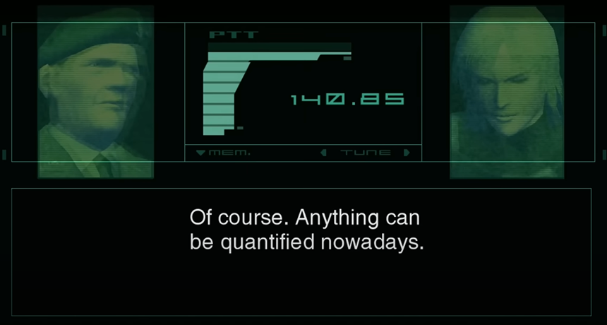
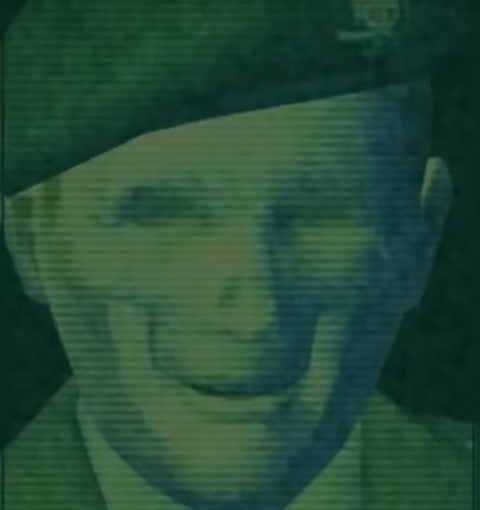

## Intro

This post is an edited transcript of the video essay(s): “**The Most Profound Moment in Gaming History**” by [Max Derrat](https://www.youtube.com/@maxderrat).

- [The Most Profound Moment in Gaming History (Part 1)](https://www.youtube.com/watch?v=jIYBod0ge3Y)
- [The Most Profound Moment in Gaming History (Part 2)](https://www.youtube.com/watch?v=PZojlidqhcM)

It analyzes the final codec conversation from [Metal Gear Solid 2](https://en.wikipedia.org/wiki/Metal_Gear_Solid_2:_Sons_of_Liberty).

I remember playing Metal Gear Solid as a kid, but it’s deep philosophical themes flew right over my head. Now, I find myself revisiting this conversation over and over again.

It is mind-blowing, thought-provoking, and ultimately terrifying.

Procede with caution. ⚠️

[size: l, aspect: 860x500]

## Transcript

[…] Video game narratives have been demonstrating a capacity to confuse, entice, and emotionally manipulate their audience in the most positive of ways.

Most recently, in fact, […] video game narratives have demonstrated such sufficient profundity, that they sometimes have matched the greatest stories told in other mediums.

[…] I would finally like to give full attention to a game which, I would argue, has the most profound moment in gaming history: I refer to the final codec conversation from [Metal Gear Solid 2: Sons of Liberty] (aka MGS2, released in 2001).

[size: s, aspect: 480x670]

[…] The advent of subjects like “Fake News”, the resurgence of rampant political correctness, and our tendency towards online tribalism has imbued this conversation with a much denser sense of meaning.

[…] **You are obligated to at least listen to this final conversation.**

**Not only will you be enlightened by its philosophical commentary, but you will be terrified by its implications, as I have been for my entire life.**

[size: l, aspect: 860x470]

> Col. R. Campbell (AI): **Raiden, are you receiving? We’re still here.**
> Raiden / Jack: **How’s that possible? The AI was destroyed!**
> Col. R. Campbell (AI): **Only GW…**
> Raiden / Jack: **Who are you?**
> Col. R. Campbell (AI): **To begin with — we’re not what you’d call — human.** **Over the past 200 years, a kind of consciousness formed layer by layer in the crucible of the White House. It’s not unlike the way life started in the oceans four billion years ago.** **The White House was our promordial soup, a base of evolution — We are formless. We are the very discipline and morality that Americans invoke so often. How can anyone hope to eliminate us? As long as this nation exists, so will we.**

Up until the end of the game, the main character Raiden believed he was receiving orders from a man named Colonel Roy Campbell, a man who was also Solid Snake’s commander throughout Metal Gear Solid 1.

At the end of Metal Gear Solid 2, Raiden learned that his Colonel was in fact an artificial intelligence manipulating Raiden to perform its political bidding. The bidding in question refers to the AI’s desire to control the human race by controlling the spread of information via the press and the Internet but we’ll focus on that more in a moment.

During the first part of this conversation, the audience learns how this AI came to be, and surprisingly, it is similar to the way human beings as a species came to be. Unlike the origin of human life in the oceans, the AI’s "life" had its basis in American idealism, hence the AI’s referencing of the White House as a symbol.

In the mind of the AI, their purpose is to push forward American values things like freedom, equality, and healthy competition. However, Raiden points out what should be an obvious contradiction in the AI’s thought process: that the AI wants to take away those freedoms via censorship.

> Raiden / Jack: **Cut the crap! If you’re immortal, why would you take away individual freedoms and censor the Net?**
> Rose (AI): **Jack, don’t be silly.**
> Col. R. Campbell (AI): **Don’t you know that our plans have your interests — not ours — in mind?**
> Raiden / Jack: **What?**
> Rose (AI): **Jack, listen carefully, like a good boy!**

Not only are the AI about to argue for the ethics of controlling information, but they are going to do so in a very condescending manner. As we move on, I suggest that you, the [reader], pay attention to how the AI demeans Raiden. Their pomposity is intrinsic to the effectiveness of their future argument.

> Col. R. Campbell (AI): **The mapping of the human genome was completed early this century. As a result, the evolutionary log of the human race lay open to us.**
> Rose (AI): **We started with genetic engineering, and in the end, we succeeded in digitizing life itself.**
> Col. R. Campbell (AI): **But there are things not covered by genetic information.**
> Raiden / Jack: **What do you mean?**
> Col. R. Campbell (AI): **Human memories, ideas. Culture. History.**
> Rose (AI): **Genes don’t contain any record of human history.**
> Col. R. Campbell (AI): **Is it something that should not be passed on?** **Should that information be left at the mercy of nature?**
> Rose (AI): **We’ve always kept records of our lives. Through words, pictures, symbols… from tablets to books…**
> Col. R. Campbell (AI): **But not all the information was inherited by later generations. A small percentage of the whole was selected and processed, and then passed on. Not unlike genes, really.**
> Rose (AI): **That’s what history is, Jack.**

What the AI is trying to do here is illustrate how genes function similar to how memes function.

If genes are “a unit of heredity which is transferred from a parent to offspring and is held to determine some characteristic of the offspring”, then a meme is something like an ethic, a fact, or an opinion that later generations inherit.

Like genes, memes are also subject to a process called “natural selection.” If certain organisms are better adapted to their environment than others, then their genes are passed on to the next generation while others have the potential to die off.

Similarly, if certain memes seemingly hold enough meaning or logic, then supposedly they survive better than memes that do not.

What distinguishes memes from genes is the nature of the selection process. Genes are more-or-less subject to the amoral discretion of nature, but memes can we analyzed and weeded out via moral discretion.

However, the AI will now illustrate how the natural selection of memes bears a unique problem in the Internet age compared to the past few centuries.

> Col. R. Campbell (AI): **But in the current, digitized world, trivial information is accumulating every second, preserved in all its triteness. Never fading, always accessible.**
> Rose (AI): **Rumors about petty issues, misinterpretations, slander…**
> Col. R. Campbell (AI): **All this junk data preserved in an unfiltered state, growing at an alarming rate.**
> Rose (AI): **It will only slow down social progress, reduce the rate of evolution.**

Prior to the Internet age, information was curated. We read about the news in newspapers, watched the news on TV, and it was all funnelled to us after passing through a, hopefully, professional body.

Granted, there was a greater potential for curators such as journalists, editors and academics to manipulate information to fit their various political biases, but at least there was some form of selection process going on.

In the age of the Internet, however, information is released so fast that it is impossible to control the discussion. Instead of listening exclusively to reporters, we are left to our own devices to derive what is valuable.

Except unlike the curators in the pre-digital age, the general population does not know how to separate the wheat from the chaff. We will focus on small, trivial issues […]. We will only listen to news sources that confirm our pre-existing political leanings, and ignore any challenging voices.

If it sounds like I am engaging in apologetics for censorship, I am not. I would never censor information under any circumstances, but, what does one do in respect to the destructive influence of human bias? The AI goes on to propose a solution.

> Col. R. Campbell (AI): **Raiden, you seem to think that our plan is one of censorship.**
> Raiden / Jack: **Are you telling me it’s not!?**
> Rose (AI): **You’re bing silly! What we propose to do is not to control content, but to create context.**
> Raiden / Jack: **Create context?**

The AI argues that because they are not prone to human error and have inner CPUs with greater processing power than the human brain, they would know how to curate information and present it to the human race in a way that doesn’t slow human evolution.

Unlike your average political body which might censor information that is inconvenient to their cause, the AI would simply present information in the most factual way possible so that political bias would not intervene, thus cooling political tensions across the political spectrum.

Of course, if something like the AI’s censorship program came into place, ethical questions would arise regarding whether or not this compromises human freedom… specifically our “free will”. Ideally, human beings should have the autonomy to make their own decisions, no matter what mistakes may follow. In response, the AI argues why the problems that arise from that freedom, supposedly necessitate censorship.

> Col. R. Campbell (AI): **The digital society furthers human flaws and selectively rewards development of convenient half-truths. Just look at the strange juxtapositions of morality around you.**
> Rose (AI): **Billions spent on new weapons in order to humanely murder other humans.**
> Col. R. Campbell (AI): **Rights of criminals are given more respect than the privacy of their victims.**
> Rose (AI): **Although there are people suffering in poverty, huge donations are made to protect endangered species. Everyone grows up being told the same thing.**
> Col. R. Campbell (AI): **Be nice to other people.**
> Rose (AI): **But beat out the competition!**
> Col. R. Campbell (AI): **”You’re special.” “Believe in yourself and you will succeed.”**
> Rose (AI): **But it’s obvious from start that only a few can succeed…**
> Col. R. Campbell (AI): **You exercise your right to “freedom” and this is the result. All rhetoric to avoid conflict and protect each other from hurt.**

Here, the AI illustrates the various ways in which human error corrupts truth. That human error arises from an instinctual drive to protect ourselves emotionally and physically, which truth tends to threaten.

For instance, let’s say a religious fundamentalist is confronted with various scientific truths that challenge their worldview. Let’s say the fundamentalist loses faith when confronted by those truths. What happens psychologically is that because the fundamentalist no longer has a belief system to make sense of the world, they are thrown into a mental pit of confusion and resentment.

That loss of structure and certainty is so painful to the ideologue that it seems it would be better to avoid that feeling at all costs. This instinct is endemic to almost all human beings.

This is why we separate ourselves into political tribes and won’t consider the ethical implications of our positions.

For instance, is it right to be pro-choice, or pro-life? Instead of considering the validity of either side’s argument, the pro-life crowd will chastise the pro-choice crowd as being on par with murderers, and the pro-choice crowd will chastise the pro-life crowd as being misogynist, religious zealots that want to control women.

These low-resolution assumptions exacerbate tensions between political parties and can potentially lead to violent conflict. Most people will avoid these difficult conversations to preserve order, but if you ignore them long enough, political positions become cemented, and people will kill each other before they admit that they’re wrong about something.

The AI then present a future where human bias corrupts the flow of information.

> Col. R. Campbell (AI): **The untested truths spun by different interests continue to churn and accumulate in the sandbox of political correctness and value systems.**
> Rose (AI): **Everyone withdraws into their own small gated community, afraid of a larger forum. They stay inside their little ponds, leaking whatever “truth” suits them into the growing cesspool of society at large.**
> Col. R. Campbell (AI): **The different cardinal truths neither clash not mesh. No one is invalidated, but nobody is right.**
> Rose (AI): **Not even natural selection can take place here. The world is being engulfed in “truth”.**
> Col. R. Campbell (AI): **And that is the way the world ends. Not with a bang, but a whimper.**

[size: l, aspect: 860x470]

As we saw in the 20th century, whether it is with Hitler’s fascism, or Stalin and Mao’s communism, the ideologically possessed would rather kill millions in the name of their ideology rather than consider the arguments of their political opponents.

We see this type of attitude in its nascent stages in the digital age.

Whether it’s calling everybody who disagrees with you a racist, sexist, homophobic Nazi, or a West-hating communist, this attitude is pervasive throughout social media, forums and comment sections.

This type of inflammatory language has further polarized our political climate, and has resulted in violent clashes.

In the mind of the AI, this is due to the fact that we insulate ourselves by staying inside our little ponds, and casting all outsiders and dissidents as bad people. If this continues to happen, who knows what violent, oppressive future might manifest?

Unlike the reality of MGS2, where a supposedly benevolent AI can make the hard decisions for us, our reality might become a sort of Orwellian nightmare, which the AI wants to prevent.

> Rose (AI): **We’re trying to stop that from happening.**
> Col. R. Campbell (AI): **It’s our responsibility as rulers. Just as in genetics, unnecessary information and memory must be filtered out to stimulate the evolution of the species.**
> Raiden / Jack: **And you thing you’re qualified to decide what’s necessary and not!?**
> Col. R. Campbell (AI): **Absolutely. Who else could wade through the sea of garbage you people produce, retrieve valuable truths and even interpret their meaning for later generations?**
> Rose (AI): **That’s what it means to create context.**

[size: l, aspect: 860x460]

I want to remind you all that Metal Gear Solid 2 came out in 2001.

This game was warning us about the advent of “Fake News”, misinformation and half truths, roughly two decades before the issue captured our collective attention. Worse yet, not only do the AIs describe a potentially dystopian future for both our reality and the reality of the game, but they also make us inadvertently realize that we currently have no constructive solution to the problem.

The only tactic available at the moment is for individuals to strengthen their moral compass, and call out misinformation where possible. However, given humanity’s inherent imperfection, even the best of us are prone to mistakes. Worse yet, instead of bolstering the best among us despite their mistakes, we will feverishly exacerbate the mistakes of our opponents for political gain.

We see this quite vividly in what has been aptly termed “[Cancel] Culture.”

For instance, […] it is thanks to this culture that people will be fired from their job over a tweet they made ten years ago. A person might even be fired for a tweet that was taken out of context, when said person did nothing wrong whatsoever. Worst of all, it is thanks to this culture that we will elect politicians not based on their ethics or policies, but on how effectively they can punch the other side.

And let me re-emphasize, we have no solution to this problem.

In the reality of MGS2, however, a hypothetical solution is presented: because people abuse the responsibility that comes along with freedom of speech and expression, and would rather attack people than their ideas, a system that controls information must be set up, supposedly for our own good.

The AI (will) go into more detail regarding this solution as the conversation goes on.

[…] (Thus far,) the Patriot AI argues that in the Internet age, the flow of information has become far too complex and grandiose. The natural outcome of this overabundance of information is that human beings, on account of their natural fallibility, are unable to separate factual and valuable information from information that is at best incomplete, and at worst filled with outright lies.

On account of our tribal instincts, our political biases our emotional fragility and flawed intellect, we will potentially embrace information that conforms to our worldview best, rather than information that is true. In the era of Fake News, this has undoubtedly been demonstrated as fact as we build up echo chambers that confirm our political leanings and demonize those who express dissent.

In response to the inherent truth of this argument, the AI proposed a frightening solution: Create a system that controls human will and consciousness. A system that compromises a human beings quote unquote "free will" to come to their own conclusions.

Though such a system is repulsive to myself and hopefully many of you, the AIs will demonstrate how human beings might abuse their freedom so much that such a system might be inevitable. Worse yet, they demonstrate how easily a system could be implemented without protest, as the main character Raiden so clearly proves.

> Raiden / Jack: **I’ll decide for myself what to believe and what to pass on!**
> Col. R. Campbell (AI): **But is that even you’re own idea?**
> Rose (AI): **Or something Snake told you?**
> Raiden / Jack: **…**
> Col. R. Campbell (AI): **That’s the proof of your incompetence, right there.** **You lack the qualifications to exercise free will.**

[size: l, aspect: 860x460]

Never in my life have I heard an insult as cutting and condescending.

> quote
> You lack the qualifications to exercise free will.
>
> byline
> Col. R. Campbell (AI)

Put aside just for a second whether or not quote unquote "free will" is a valid concept. To say that somebody lacks the qualifications to exercise free will, suggests that their personality is entirely constructed by outside forces.

For example, if you believe that abortion is an unethical practice, or an ethical practice, did you come to that conclusion yourself?

Did you put together a bunch of arguments from opposing sides and decide for yourself what the best answer was? Or did you hear one person's argument and close yourself off to opposing arguments?... much like an ideologue tends to do. In regards to Raiden, the A.I. goes on to demonstrate that he, like billions of people on the planet, tend to embrace ideas and actions not necessarily based on their adherence to truth, but rather based on how effectively they promote a certain way of being.

This goes back to Nietzsche's famous criticism of philosophers and Beyond Good and Evil.

While philosophers might proclaim a desire for objective truth, they are more than likely trying to justify their worldview and way of life.

This is why Fake News exists.

This is why echo chambers crop up all over the Internet, despite the wealth of information available to us that should allow us to live in accordance with truth.

It is because living in accordance with truth and developing a sense of free will can be life threatening.

So, people choose to embrace falsehoods in order to protect their sanity.

Raiden then desperately protests that he is not a product of the mindless masses.

> Raiden / Jack: **That’s not true! I have the right —**
> Rose (AI): **Does something like the “self” exist inside of you?**
> Col. R. Campbell (AI): **That which you call “self” serves as nothing more that a mask to cover your own being.**
> Rose (AI): **In this era of ready-made “truths”, “self” is just something used to preserve those positive emotions you occasionally feel…**
> Col. R. Campbell (AI): **…Another possibility is that “self” is a concept you conveniently borrowed under the logic that it would endow you with some sense of strength…**
> Raiden / Jack: **That’s crap!**
> Col. R. Campbell (AI): **Is it? Would you prefer that someone else tell you? Alright then. Explain it to him.**
> Rose (AI, and image of his girlfriend): **Jack, you’re simply the best! And you got there all by yourself!**
> Raiden / Jack: **Rrrr…**

Up until this point in the game, Raiden and the player believed that their successes were achieved entirely by their own merit.

However, the AI revealed that the entire mission was structured in a way so that Raiden would succeed, as long as he obeyed orders.

For Raiden to find out that he was not in fact a legendary mercenary, but rather a clueless puppet that helped enslave the world, is bad enough.

However, it is when the AI offers the more ideal fiction to Raiden that he is "simply the best", that the insult has its greatest effect.

Raiden cringes and hold back a scream because he sees the truth inherent in the A.I.'s argument.

That argument being that Raiden is not his own person. His actions and emotions are all controlled by a higher power.

He's not Raiden. He's not even Jack.

He's something else's creation.

The AI then go on to show how Raiden's lack of self is endemic to billions of people.

> Col. R. Campbell (AI): **Oh, what happened? Do you feel lost? Why not try a little bit of soul-searching?**
> Rose (AI): **Don’t think you’ll find anything, though…**
> Col. R. Campbell (AI): **Ironic that although “self” is something that oyu yourself fashioned, every time that something goes wrong, you turn around and place the blame on something else.**
> Rose (AI): **It’s not my fault. It’s not your fault.**
> Col. R. Campbell (AI): **In denial, you simply resort to looking for another, more convenient “truth” in order to make yourself feel better.**
> Rose (AI): **…Leaving behing in an instant the so-called “truth” you once embraced.**

Once again, the AI demonstrate how people will gravitate to quote-unquote "truths" not because they are based entirely on empirical fact, but because they satisfy the instinctual need for structure and stability.

For argument's sake, let's imagine somebody who has spent half their life advocating a belief that the earth was flat; that the government wants people to believe it is round for territorial reasons.

Let's say the flat earther is presented conclusive information that proves the earth is round. If they accept that they were wrong, that would mean they spent over half their life advocating falsehoods and manipulating impressionable minds. What toll would that realization take upon their soul? If they don't accept that they were wrong, they will accept a more convenient truth to protect their emotional persona.

Such a truth might be that the evidence presented to them was doctored, and that the person presenting the information is a government shill. This behavior extends not just to conspiracy theorists, but anybody with a political position. This is the reason why millions of people continue to advocate for political systems despite their proven track record of killing millions of people.

This is why people still uphold certain superstitious beliefs despite their scientific invalidity.

This behavior is not relegated to a few irrational individuals. It's something that everybody does, regardless of their political position. I do it, and you do it... and worst of all, in a democracy, the emotionally fragile have a say in what is truth... which the AI shall now criticize.

> Col. R. Campbell (AI): **Should someone like that be able to decide what is “truth”?**
> Rose (AI): **Should someone like you even have the right to decide?**
> Col. R. Campbell (AI): **You’ve done nothing but abuse your freedom.**
> Rose (AI): **You don’t deserve to be free!**
> Col. R. Campbell (AI): **We’re not the ones smothering the world. You are.**

Because the AIs grew out of the White House's quote-unquote "primordial soup", they recognize the inherent value of freedom, and the responsibility that comes along with it. In their mind, Raiden, and billions like him, take all the benefits of freedom, without accepting any of the responsibility that comes along with it.

Instead of using their freedom to seek out truths that foster the human race, they resort to partisanship and ideology to make sense of the world. Instead of being introspective and considering the potential faults in one's position, they will cast the blame elsewhere.

The result of this is stagnation, and soon afterwards violence. This extends not just to our leaders, but to ourselves.

> Rose (AI): **The individual is supposed to be weak. But far from powerless — a single person has the potential to ruin the world.**
> Col. R. Campbell (AI): **And the age of digitized communication has given even more power to the individual. Too much power for an immature species.**
> Rose (AI): **Building a legacy involves figuring out what is wanted, and what needs to be done for that goal. All this, you used to struggle with. Now, we think for you.**
> Col. R. Campbell (AI): **We are your guardians after all.**
> Raiden / Jack: **You want to control human thought? Human behavior?**
> Col. R. Campbell (AI): **Of course. Anything can be quantified nowadays.**

[size: l, aspect: 860x460]

[…] Put aside their conclusion, and consider whether or not their arguments are wrong:

- Do human beings consume Fake News and accept it as truth?
- Do billions of people hold beliefs that are objectively wrong?
- Can ideologues and fundamentalists negatively influence our societies?

If the 20th century is any indication, it only takes one bad idea, and maybe even one bad person to ruin the world.

In the social media age, this ruination becomes all the more likely as almost anybody can build up a large enough following to influence millions of minds. They don't even need a large following! They could just covertly produce a system like the one the AIs are proposing. And when AI inevitably comes to be, maybe our reality could see its reflection in the reality of Metal Gear Solid 2.

[size: l, aspect: 860x480]

[…] Before I play the final clip, I wish to summarize with the AI accomplished.

They created a scenario where Raiden, and by extension the player, had to obey several different orders from their commanding officer. It did not matter if many of those orders seemed unjustifiable... what mattered to Raiden and the gamer was being able to live out a fantasy as a legendary mercenary.

That emotional desire was so strong that it prevented any form of rationality.

This emotional desire overcoming rationality, is reflective of many different situations in our everyday lives.

We see it in our news feeds, on our social media, and even in our own actions.

Unlike human beings, AI are not prone to emotion. For this reason the AIs feel they are the saviors of humankind.

They will control thoughts so human beings may live in blissful ignorance, and the AIs no longer have to tolerate mass stupidity.

In their victory, the AI mocks Raiden for his various faults.

> Col. R. Campbell (AI): **So you see, you’re a perfect representative of the masses we need to protect. This is why we chose you.**  **You accepted the fiction we’ve provided, obeyed our orders and did everything you were told to.**  **The exercise is a resounding success.**  **Your persona, experiences, triumphs and defeats are nothing but byproducts.**  **The real objective was ensuring that we could generate and manipulate them.**  **It’s taken a lot of time and money, but it was well worth it considering the results.**

Is _this_ our future? If we have no systemic solution to the problem of Fake News, and we continue to drown in overflowing information, what will our society become?

This video game — not a book, not a movie, _a video game_ — so eloquently explained the impossibility of this problem roughly two decades before it reached public consciousness.

The fact that it was all done within this 15-minute conversation, makes it truly the most profound moment in gaming history.

**It is a moment that has haunted me for decades.** […]

[size: m, aspect: 480x510]

---

## Resources

If you’d like to see the conversation in full (without the essay's commentary), here are a few links:

- [Colonel JD AI Codec Conversation MGS2 HD](https://www.youtube.com/watch?v=eKl6WjfDqYA)
- [Metal Gear Solid 2: Sons of Liberty Cutscenes - Ending](https://www.youtube.com/watch?v=_rRA49RlP2g)
