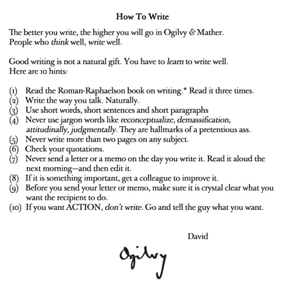
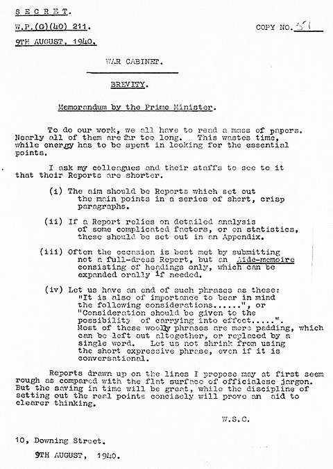

> quote
>
> For many writers, you can't neglect the gardening process. You don't harvest every day. You have to tend the garden for a long time in between harvests. If you start to neglect the gardening, […] then you're not doing the work of being in there and tending your garden. That's undermining your future harvest (even if you can't see it right now).
>
> byline
> Gwern

---

## Intro

Mostly, this is an appreciation post for what others have said so much better than I could hope to write myself.

Below, you will find a word-for-word copy of the writing advice from these great thinkers and writers:

- **Scott Adams**: The Day You Became A Better Writer
- **David Ogilvy**: How to Write
- **Paul Graham**: Write like you talk
- **Winston Churchill**: Brevity
- **David Perell**: The Best Sentences Are CLEAR

## Advice

### Scott Adams: The Day You Became A Better Writer

> I went from being a bad writer to a good writer after taking a one-day course in “business writing.” I couldn’t believe how simple it was. I’ll tell you the main tricks here so you don’t have to waste a day in class.
>
> Business writing is about clarity and persuasion. The main technique is keeping things simple. Simple writing is persuasive. A good argument in five sentences will sway more people than a brilliant argument in a hundred sentences. Don’t fight it.
>
> Simple means getting rid of extra words. Don’t write, “He was very happy” when you can write “He was happy.” You think the word “very” adds something. It doesn’t. Prune your sentences.
>
> Humor writing is a lot like business writing. It needs to be simple. The main difference is in the choice of words. For humor, don’t say “drink” when you can say “swill.”
>
> Your first sentence needs to grab the reader. Go back and read my first sentence to this post. I rewrote it a dozen times. It makes you curious. That’s the key.
>
> Write short sentences. Avoid putting multiple thoughts in one sentence. Readers aren’t as smart as you’d think.
>
> Learn how brains organize ideas. Readers comprehend “the boy hit the ball” quicker than “the ball was hit by the boy.” Both sentences mean the same, but it’s easier to imagine the object (the boy) before the action (the hitting). All brains work that way. (Notice I didn’t say, “That is the way all brains work”?)
>
> That’s it. You just learned 80% of the rules of good writing. You’re welcome.

### David Ogilvy: How to Write

[size: m, aspect: 480x490]

> How To Write
>
> The better you write, the higher you will go in Ogilvy & Mather.
>
> People who think well, write well.
>
> Good writing is not a natural gift. You have to learn to write well.
>
> Here are 10 hints:
>
> 1. Read the Roman-Raphaelson book on writing. Read it three times.
> 2. Write the way you talk. Naturally.
> 3. Use short words, short sentences and short paragraphs
> 4. Never use jargon words like _reconceptualize_, _demassification_, _attitudinally_, _judgmentally_. They are hallmarks of a pretentious ass.
> 5. Never write more than two pages on any subject.
> 6. Check your quotations.
> 7. Never send a letter or a memo on the day you write it. Read it aloud the next morning—and then edit it.
> 8. If it is something important, get a colleague to improve it.
> 9. Before you send your letter or memo, make sure it is crystal clear what you want the recipient to do.
> 10. If you want ACTION, don't write. Go and tell the guy what you want.
>
> — David

### Paul Graham: Write like you talk

> Here's a simple trick for getting more people to read what you write: write in spoken language.
>
> Something comes over most people when they start writing. They write in a different language than they'd use if they were talking to a friend. The sentence structure and even the words are different. No one uses "pen" as a verb in spoken English. You'd feel like an idiot using "pen" instead of "write" in a conversation with a friend.
>
> The last straw for me was a sentence I read a couple days ago:
>
> _The mercurial Spaniard himself declared: "After Altamira, all is decadence."_
>
> It's from Neil Oliver's A History of Ancient Britain. I feel bad making an example of this book, because it's no worse than lots of others. But just imagine calling Picasso "the mercurial Spaniard" when talking to a friend. Even one sentence of this would raise eyebrows in conversation. And yet people write whole books of it.
>
> Ok, so written and spoken language are different. Does that make written language worse?
>
> If you want people to read and understand what you write, yes. Written language is more complex, which makes it more work to read. It's also more formal and distant, which gives the reader's attention permission to drift. But perhaps worst of all, the complex sentences and fancy words give you, the writer, the false impression that you're saying more than you actually are.
>
> You don't need complex sentences to express complex ideas. When specialists in some abstruse topic talk to one another about ideas in their field, they don't use sentences any more complex than they do when talking about what to have for lunch. They use different words, certainly. But even those they use no more than necessary. And in my experience, the harder the subject, the more informally experts speak. Partly, I think, because they have less to prove, and partly because the harder the ideas you're talking about, the less you can afford to let language get in the way.
>
> Informal language is the athletic clothing of ideas.
>
> I'm not saying spoken language always works best. Poetry is as much music as text, so you can say things you wouldn't say in conversation. And there are a handful of writers who can get away with using fancy language in prose. And then of course there are cases where writers don't want to make it easy to understand what they're saying—in corporate announcements of bad news, for example, or at the more bogus end of the humanities. But for nearly everyone else, spoken language is better.
>
> It seems to be hard for most people to write in spoken language. So perhaps the best solution is to write your first draft the way you usually would, then afterward look at each sentence and ask "Is this the way I'd say this if I were talking to a friend?" If it isn't, imagine what you would say, and use that instead. After a while this filter will start to operate as you write. When you write something you wouldn't say, you'll hear the clank as it hits the page.
>
> Before I publish a new essay, I read it out loud and fix everything that doesn't sound like conversation. I even fix bits that are phonetically awkward; I don't know if that's necessary, but it doesn't cost much.
>
> This trick may not always be enough. I've seen writing so far removed from spoken language that it couldn't be fixed sentence by sentence. For cases like that there's a more drastic solution. After writing the first draft, try explaining to a friend what you just wrote. Then replace the draft with what you said to your friend.
>
> People often tell me how much my essays sound like me talking. The fact that this seems worthy of comment shows how rarely people manage to write in spoken language. Otherwise everyone's writing would sound like them talking.
>
> If you simply manage to write in spoken language, you'll be ahead of 95% of writers. And it's so easy to do: just don't let a sentence through unless it's the way you'd say it to a friend.

### Winston Churchill: Brevity

[size: m, aspect: 480x675]

> BREVITY.
>
> Memorandum by the Prime Minister.
>
> To do our work, we all have to read a mass of papers. Nearly all of them are far too long. This wastes time, while energy has to be spent in looking for the essential points.
>
> I ask my colleagues and their staffs to see to it that their Reports are shorter.
>
> (i) The aim should be Reports which set out the main points in a series of short, crisp paragraphs.
>
> (ii) If a Report relies on detailed analysis of some complicated factors, or on statistics, these should be set out in an Appendix.
>
> (iii) Often the occasion is best met by submitting not a full-dress Report, but an Aide-memoire consisting of headings only, which can be expanded orally if needed.
>
> (iv) Let us have an end of such phrases as these: "_It is also of importance to beer in mind the following considerations......_", or "_Consideration should be given to the possibility of carrying into effect....._". Most of these woolly phrases are mere padding, which can be left out altogether, or replaced by a single word. Let us not shrink from using the short expressive phrase, even if it is conversational.
>
> Reports drawn up on the lines I propose may at first seem rough as compared with the flat surface of officialese jargon. But the saving in time will be great, while the discipline of setting out the real points concisely will prove an aid to clearer thinking.
>
> — W.S.C.

### David Perell: The Best Sentences Are CLEAR

> The best sentences are CLEAR.
>
> 1. Connect to the previous sentence.
> 2. Link to the following sentence.
> 3. Eliminate anything that adds confusion.
> 4. Add colorful details.
> 5. Remove unnecessary words.
>
> Improve your writing by remembering the acronym CLEAR.

[David Perell](https://perell.com/) also interviews many great writers on his podcast, [How I Write](https://www.youtube.com/@DavidPerellChannel).

## Conclusion

So as you can see, most of the advice is to write clearly using simple words and simple sentences.

Though of course, not always. 

Knowing exactly _when_ and _how_ to break this rule is what separates poor writing from great writing.

As for me, I have no particular insights into writing beyond [just doing it, and struggling through it](/notes/hello-universe/#write). Having a _garden_ of drafts, notes, and quotes that you constantly grow and prune is great too.

And yes, even in the age of AI, writing still matters.

Clear writing is clear thinking.

---

P.S. RIP Scott Adams.
